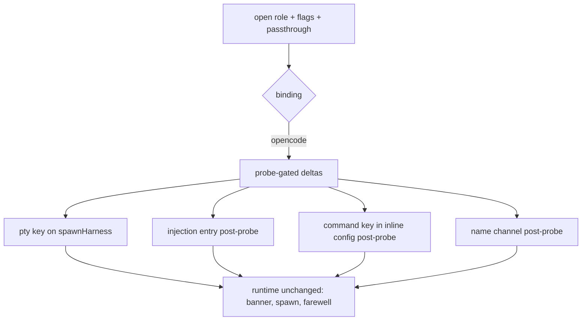

# Opencode parity in open Design

**Spec**: `.specs/features/open-opencode-parity/spec.md`
**Status**: Draft

Approach A+C (confirmed): extend the three-jurisdiction split in place, probes first with committed transcripts, implement only what probes confirm. No `OpenLauncher` interface in this feature (see Tech Decisions).

---

## Architecture Overview

No new modules. The opencode branch of `registerOpenCommand` gains what the claude branch already has: a `pty` key on its `spawnHarness` call, a name channel, and a captured id flowing into the existing farewell. The injection table gains one entry post-probe. `resumeHint` is reused unchanged (the CLI flag is `--resume` on both harnesses; `--session` is only the down-translation inside `buildArgs`).

Probe order (each gates its ACs): rename command, command key, id capture, name channel, effort reader. P2 worktree needs no probe (CodeDeck-owned path).

---

## Code Reuse Analysis

### Existing Components to Leverage

| Component | Location | How to Use |
| --------- | -------- | ---------- |
| `ptyLaunchForHarness`, `startPtySession`, `watchNameSidecar` | `src/open/pty.ts` | Wire the opencode branch the way claude is wired; no changes to the pty itself |
| `HARNESS_INJECTION`, `sanitizeInjectedArgument`, `slashCommandKeystrokes` | `src/open/injection.ts` | Add the opencode entry post-probe; shape follows the probe (slash command or as pinned) |
| `buildInlineConfig`, `buildArgs`, `rolePermission` | `src/open/launchers/opencode.ts` | Add the command key post-probe; keep `permission` map untouched |
| `resumeHint`, `finishOpenSession`, `spawnHarness` | `src/open/runtime.ts` | Reuse unchanged; farewell prints `--resume` (the CLI flag, both harnesses) |
| `sessionName` | `src/open/launchers/claude.ts` | Reference for the `CodeDeck · project · role` derivation rule on the opencode channel |
| `createWorktree` | `src/git/worktree.ts` | P2: build the checkout from the repo root of cwd with the open `runId` |
| `harnessMismatch`, `launcherFor` | `src/cli/commands/open.ts` | Untouched; dispatch stays binding-driven |

### Integration Points

| System | Integration Method |
| ------ | ------------------ |
| Opencode TUI | Keystrokes via owned pty + inline env config; both validated by live probe transcripts |
| `run --worktree` | Same `src/git/worktree.ts` entry, same persist-after-close lifecycle |
| Suite `open-args` + new scoped tests | Pin `--resume` farewell spelling, effort warning string, worktree cwd |

---

## Components

### Opencode pty wiring (`src/cli/commands/open.ts`, opencode branch)

- **Purpose**: Give the opencode spawn the same owned pty the claude spawn has.
- **Location**: `src/cli/commands/open.ts` (opencode branch, ~line 447)
- **Interfaces**:
  - Reuse `ptyLaunchForHarness("opencode", pluginDir, sessionFile, opts, config, interactive)` - same call shape as claude, harness parameter flipped
  - Pass the result as the `pty` key of the existing `spawnHarness` call
- **Dependencies**: `src/open/pty.ts`, `src/open/injection.ts`
- **Reuses**: `ptyLaunchForHarness`, `startPtySession`, `watchNameSidecar` unchanged

### Opencode injection entry (`src/open/injection.ts`)

- **Purpose**: Keystrokes that rename the live opencode session, typed exactly once per first-prompt slug.
- **Location**: `src/open/injection.ts` (`HARNESS_INJECTION.opencode`)
- **Interfaces**:
  - `rename: (name) => string | undefined` - exact shape TBD by probe transcript; `sanitizeInjectedArgument` reuse is mandatory, `slashCommandKeystrokes` shape only if the probe finds a slash command
- **Dependencies**: Probe transcript `probe-rename-<date>.txt`
- **Reuses**: Sanitizer and once-only watcher unchanged

### Inline command delivery (`src/open/launchers/opencode.ts`)

- **Purpose**: Carry `/autonomous` (body = md minus frontmatter) through `OPENCODE_CONFIG_CONTENT` once the probe pins the key.
- **Location**: `src/open/launchers/opencode.ts` (`buildInlineConfig`)
- **Interfaces**:
  - `buildInlineConfig(pluginDir, role, mode)` - additive key only, existing `instructions` + `agent` untouched
- **Dependencies**: Probe transcript `probe-command-<date>.txt`
- **Reuses**: `resolveRoleContract` for the body text

### Resume capture (no new component)

- **Purpose**: Feed the native opencode id into the existing farewell.
- **Location**: Pty output leading window (same technique as `PTY_SCAN_LIMIT`) or `opencode session list`, per probe
- **Interfaces**: None new; `finishOpenSession(role, sessionFile)` unchanged
- **Dependencies**: Pty wiring component above; probe transcript `probe-session-id-<date>.txt`

### P2: Worktree + effort (`src/cli/commands/open.ts`, opencode branch)

- **Purpose**: Replace warn-and-continue (`--worktree`) and silent default (`--effort`) with behavior or exact warnings.
- **Location**: `src/cli/commands/open.ts` (opencode branch)
- **Interfaces**:
  - Worktree: `createWorktree({repoRoot, sessionId: runId, ...})`, cwd becomes the checkout; retires OO-20 for opencode
  - Effort: exact warning `Warning: --effort has no effect on opencode (no mapped reader); continuing with "default".` while unpinned
- **Dependencies**: `src/git/worktree.ts`
- **Reuses**: Worktree lifecycle of `run --worktree`

---

## Error Handling Strategy

| Error Scenario | Handling | User Impact |
| -------------- | -------- | ----------- |
| Probe negative (rename/command/name/effort) | Documented fallback in spec (OP-07/OP-12/OP-16), transcript committed | Feature stays Claude-only on that slice, explicitly |
| Pty unavailable on opencode | Plain spawn, no rename, exit 0 (OP-03) | Session opens, rename skipped silently like today |
| Worktree creation fails | Fail before spawn with the git error (OP-14) | No session in the wrong cwd |
| Empty-after-sanitize name | Type nothing (OP-18) | No garbage typed into the session |

---

## Risks & Concerns

| Concern | Location (file:line) | Impact | Mitigation |
| ------- | -------------------- | ------ | ---------- |
| Keystrokes typed into a live session | `src/open/pty.ts:312` (`inject`) | A wrong command string lands as prompt text | Probe-first gate; entry stays empty until transcript pins it (OP-02) |
| Raw-mode terminal handling shared by both harnesses | `src/open/pty.ts:261` | Regression risk on the verified claude path | No changes to `pty.ts`; scoped tests on the opencode branch only |
| First-run theme write looks like config mutation | `src/open/launchers/opencode.ts:144` | Tests asserting "no writes" fail on first run | Scope assertions to "besides the managed theme file" (OP-19) |
| OO-20 contradiction if forgotten | `src/cli/commands/open.ts:418` | Implementer satisfies warn-and-continue instead of OP-13 | Retirement line in spec edges; P2 task cites it explicitly |

---

## Tech Decisions (only non-obvious ones)

| Decision | Choice | Rationale |
| -------- | ------ | --------- |
| No `OpenLauncher` interface now | Extend in place (approach A) | Formalizing the strategy churns the verified claude path for no P1 behavior; revisit as its own feature |
| Farewell prints `--resume` on opencode | Reuse `resumeHint` unchanged | `--resume` is the `open` CLI flag on both harnesses; `--session` exists only inside `buildArgs` |
| Probes before code, transcripts committed | `probe-<topic>-<date>.txt` in the feature dir | Mirrors `open-opencode/probe-2026-09-06.txt`; a negative probe retires the AC instead of blocking the story |
| Worktree lifecycle follows `run` | Persist after close, no auto-delete | Same ownership story as `run --worktree`; no new cleanup machinery |

> **Project-level decisions:** none new. No `.specs/STATE.md` exists yet; if one is created later, the OO-20 retirement (warn-and-continue superseded by CodeDeck-side worktree on opencode open) is the candidate first entry.
