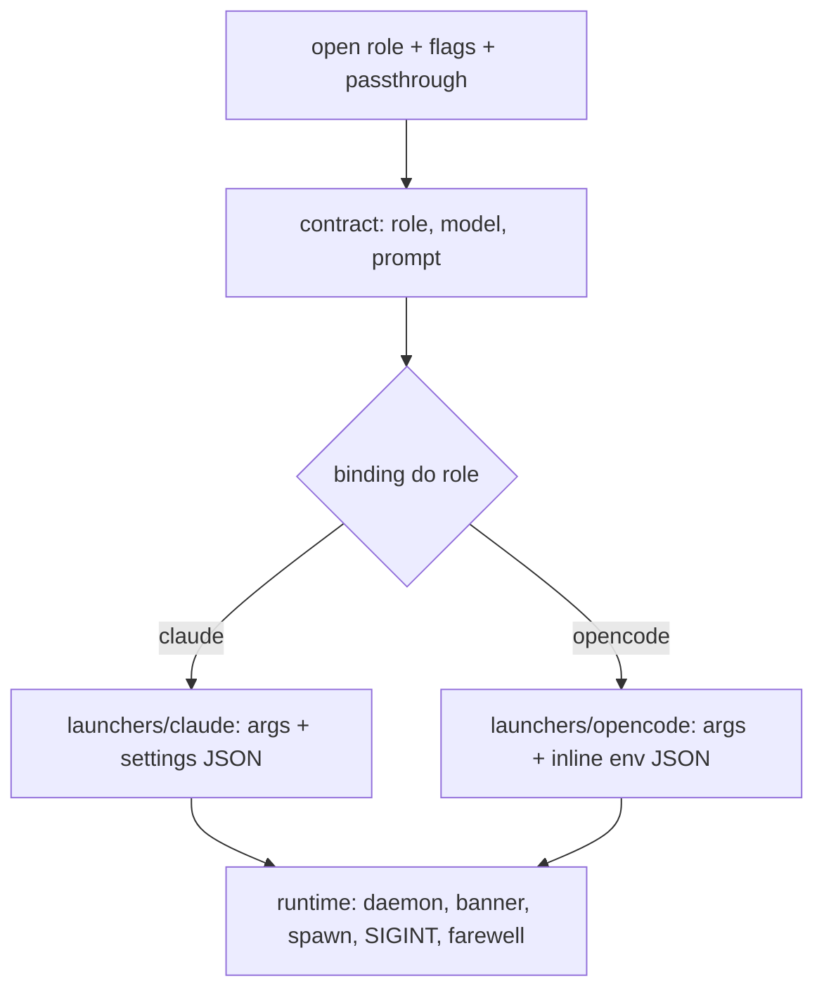

# Open multi-harness Design

**Spec**: `.specs/features/open-opencode/spec.md`
**Status**: Approved

---

## Architecture Overview

O `open.ts` atual vira um registrador fino que resolve o role, lê o binding e despacha para um launcher. Três jurisdições, como a spec define: contrato (prompt, idêntico entre harnesses), UI (um adapter por harness) e runtime (spawn e sessão, compartilhado).

O launcher opencode não escreve arquivo nenhum. O contrato viaja em `OPENCODE_CONFIG_CONTENT` (sondado: agente, prompt, permission e instructions resolvidos pelo `debug agent`/`debug config` sem tocar `~/.config/opencode`).

---

## Code Reuse Analysis

### Existing Components to Leverage

| Component | Location | How to Use |
| --------- | -------- | ---------- |
| `parseRole`, `ROLES`, `resolvePluginDir`, `roleBody`, `roleFile` | `src/core/roles.ts` | Contrato usa direto, sem mudar; `roleBody` já tira o frontmatter |
| `getCachedOrDiscoverModels`, `findClosestModel`, `modelNames` | `src/core/models.ts` | Preflight dos dois launchers; assinatura já aceita `{ agent }` |
| `resolveRoleBinding`, `resolveModel`, `loadConfig` | `src/config/config.ts` | Registrar usa direto |
| `getRegistry`, `detectBinary` | `src/drivers/registry.ts`, `src/drivers/helpers.ts` | `resolveBinary` de cada launcher |
| `IpcClient.ensureDaemonStarted` | `src/daemon/ipc.ts` | Runtime chama e deixa propagar |
| `renderLogo`, `renderFarewell`, `INDENT` | `src/cli/ui.ts` | Banner e farewell mudam de arquivo, não de forma |
| `scanOptions`, `getInvocation`, `isNonInteractiveLaunch`, `resolveRole` | `src/cli/commands/open.ts` | Ficam no registrador (são commander-específicos) |
| `installSigintGuard`, `sanitizeEnv`, `withCodedeckOnPath`, `ensureCodedeckShim`, `exitCodeFor`, `takeSessionId` | `src/cli/commands/open.ts` | Mudam para `runtime.ts` sem mudar comportamento |

### Integration Points

| System | Integration Method |
| ------ | ------------------ |
| Commander | `src/cli/commands/open.ts` mantém `registerOpenCommand` e o parse antes do `--`; o resto sai do arquivo |
| Suite `open-args` | `buildOpenArgs`/`buildSettings` mudam de módulo com assinatura idêntica; expectativa intocada (`OO-03`) |
| Plugin `plugin/agents/*.md` | Lido como hoje; frontmatter continua valendo só no Claude, corpo vira `prompt` no opencode |

---

## Components

### contract (`src/open/contract.ts`)

- **Purpose**: Resolve tudo que é idêntico entre harnesses: role, corpo do agente, ultra, modelo e veredito puro de catálogo. Nada aqui recebe harness como parâmetro: a busca do catálogo é por launcher, o veredito sobre o catálogo é puro.
- **Location**: `src/open/contract.ts`
- **Interfaces**:
  - `resolveRoleContract(pluginDir: string, role: Role): { agentBody: string; ultra: string }` - lê `roleBody` + `ultra.md`; falha alto se o plugin está incompleto (`OO-18`)
  - `resolveOpenModel(role: Role, opts: OpenFlags, config: RunAgentConfig): { model: string; fromConfig: boolean }` - flag vence binding, como hoje
  - `effectiveModel(passthrough: string[]): string | undefined` - move puro como está; último `--model` vence (`OO-06`)
  - `judgeModelIn(catalog: HarnessModels | undefined, model: string, fromConfig: boolean): ModelVerdict` - o `judgeModel` atual sem o `agent === "claude"` fixo (`open.ts:835`); recebe o catálogo já filtrado em vez do array inteiro
- **Dependencies**: `src/core/roles.ts`, `src/core/models.ts`, `src/config/config.ts`
- **Reuses**: `roleBody`, `findClosestModel` via `judgeModelIn`

### runtime (`src/open/runtime.ts`)

- **Purpose**: Tudo que envolve o terminal e o processo filho, igual para qualquer harness.
- **Location**: `src/open/runtime.ts`
- **Interfaces**:
  - `spawnHarness(bin: string, args: string[], opts: { cwd: string; envExtra: Record<string, string>; sessionFile: string; model: string; onClose: () => void }): Promise<void>` - o `launchClaude` atual com o nome honesto; `stdio inherit + pipe(stderr)`, guard SIGINT, tradução de entitlement opcional por callback
  - `playBoot / renderBanner / finishOpenSession / resumeHint / renderExit` - mudam de arquivo sem mudar forma
  - `installSigintGuard / sanitizeEnv / withCodedeckOnPath / ensureCodedeckShim / exitCodeFor` - mudam de arquivo sem mudar comportamento
- **Dependencies**: `src/daemon/ipc.ts` (daemon), `src/cli/ui.ts` (logo/farewell)
- **Reuses**: Corpo atual de `open.ts:426-501`, `563-595`, `969-1046`

### Claude launcher (`src/open/launchers/claude.ts`)

- **Purpose**: Adapter de UI + args só-Claude.
- **Location**: `src/open/launchers/claude.ts`
- **Interfaces**:
  - `buildOpenArgs(role, flags, pluginDir, passthrough): string[]` - assinatura idêntica à atual
  - `buildSettings(pluginDir, flags): Record<string, unknown>` - idem, incluindo o path resolvido da statusline
  - `resolveBinary(): Promise<string>` - renomeado de `resolveClaudeBinary`, `detectBinary("claude")` + erro de instalação
  - `preflight(model: string, fromConfig: boolean): Promise<void>` - busca via `getCachedOrDiscoverModels(registry, { agent: "claude" })`, veredito via `judgeModelIn`, warn-and-continue quando o catálogo falta
  - `assertSupport(bin, cwd): Promise<void>` - renomeado de `assertSystemPromptFlagSupported`, sonda `--append-system-prompt-file`
  - `entitlementError(model, output): string | undefined` - tradução atual, sem mudar
- **Dependencies**: contract (modelo), runtime (nada; launcher só monta)
- **Reuses**: `open.ts:234-286` movidos

### Opencode launcher (`src/open/launchers/opencode.ts`)

- **Purpose**: Monta o env inline e os args do TUI.
- **Location**: `src/open/launchers/opencode.ts`
- **Interfaces**:
  - `agentName(role: Role): string` - retorna `codedeck-<role>`; prefixo evita colidir com agentes do usuário ou do projeto
  - `buildInlineConfig(pluginDir: string, role: Role): string` - JSON de `OPENCODE_CONFIG_CONTENT`: `{ instructions: [ultra], agent: { [agentName]: { mode: "primary", description, prompt: agentBody, permission } } }`; função pura, testável sem spawn
  - `rolePermission(role: Role): Record<string, "allow" | "deny">` - mapa abaixo
  - `buildArgs(role, flags: OpenFlags & { model: string }, passthrough: string[]): string[]` - `["--agent", agentName, "--model", model, ...auto, ...resume, ...passthrough]`; `--model` exige formato `provider/model` (`OO-21`)
  - `preflight(model: string, fromConfig: boolean): Promise<void>` - busca via `getCachedOrDiscoverModels(registry, { agent: "opencode" })`, veredito via `judgeModelIn`, warn-and-continue quando o catálogo falta (`OO-10`, `OO-15`)
  - `resolveBinary(): Promise<string>` - `detectBinary("opencode")` + erro de instalação (`OO-09`)
- **Dependencies**: contract (corpo, ultra, modelo)
- **Reuses**: `roleBody` para o `prompt`; nada de `buildSettings` (não porta)

### Registrar (`src/cli/commands/open.ts`, fino)

- **Purpose**: Parse commander, resolve role/binding/modelo, despacha para o launcher do harness e entrega ao runtime.
- **Location**: `src/cli/commands/open.ts`
- **Interfaces**:
  - `registerOpenCommand(program)` - mesmo argv de hoje; `harnessMismatch` sai (virou dispatch por `binding?.harness ?? "claude"`); `--worktree` no opencode avisa e segue (`OO-20`)
  - Re-exports mantidos (`ROLES`, `parseRole`, `resolvePluginDir`, `Role`, `SPINNER_VERB_WIDTH`) - a suite importa de `open.js` e não muda
- **Dependencies**: contract, runtime, launchers, config

---

## Requirement coverage (OO → componente)

| Requisito | Componente |
| --------- | ---------- |
| OO-01 args do Claude preservados | launchers/claude `buildOpenArgs` |
| OO-02 contrato sem dependência de harness | contract (sem import de launchers; teste pinna) |
| OO-03 suite verde sem mudar expectativa | migração por movimento puro + re-exports no registrar |
| OO-04 dispatch no opencode em vez de erro | registrar (binding → launcher) |
| OO-05 conteúdo inline | launchers/opencode `buildInlineConfig` |
| OO-06 flags `--agent/--model/--auto` | launchers/opencode `buildArgs` + contract `effectiveModel` |
| OO-07 `--resume` vira `--session` | launchers/opencode `buildArgs` |
| OO-08 passthrough verbatim | registrar (`getInvocation`) + launchers (anexo final) |
| OO-09 binário ausente | launchers `resolveBinary` |
| OO-10 consulta ao catálogo | launchers `preflight` (busca) |
| OO-11 farewell sem limpeza | runtime `finishOpenSession` |
| OO-12 daemon garantido | runtime (propaga) |
| OO-13 `--no-theme` aceito no opencode | launchers/opencode (ignora flag, TUI stock) |
| OO-14 sonda recusa edit | mapa `rolePermission` + `buildInlineConfig` |
| OO-15 rejeição com veredito por harness | launchers `preflight` + contract `judgeModelIn` |
| OO-16 TUI stock sem promessa | launchers/opencode (ausência deliberada) |
| OO-17 resultado da sonda na spec | processo (tabela de suposições), não código |
| OO-18 montagem falha antes do spawn | contract `resolveRoleContract` (falha alto) |
| OO-19 env próprio por processo | launchers/opencode (puro, sem disco) |
| OO-20 `--worktree` avisa e segue | registrar |
| OO-21 formato `provider/model` | launchers/opencode `buildArgs` |
| OO-22 `cwd` morto | runtime/registrar (`currentWorkingDirectory`, como hoje) |
| OO-23 fora de git | nenhum (ausência de validação, como hoje) |

---

## Permission map (Claude `tools:` → opencode `permission:`)

Tudo sondado ao vivo via `opencode debug agent` com env fixture: `edit: deny` resolve `edit:false/write:false`; `read: deny` resolve `read:false` com `bash:true` intacto; `task: deny` resolve `task:false`; `"*": "allow"` resolve tudo `true`. Nenhuma chave do mapa depende só de doc. O teste do mapa pinna esses resolvidos por role.

| Role | Claude hoje | Opencode (`rolePermission`) |
| ---- | ----------- | -------- |
| `general` | sem `tools:` (irrestrito) | `{ "*": "allow" }` |
| `orchestrator` | só `Bash` | `{ read: deny, edit: deny, write: deny, task: deny, bash: allow }` |
| `reviewer` | tudo menos `Edit`/`Write`/`Task` | `{ edit: deny, write: deny, task: deny, bash: allow }` |
| `auditor` | como reviewer + `Task` | `{ edit: deny, write: deny, task: allow, bash: allow }` |

O `reviewer` mantém `bash` nos dois lados, com o mesmo buraco de redirecionamento. Veredito final é o da sonda `OO-14`; se ela mostrar escrita via bash, a linha do reviewer muda para `bash: deny` e a suposição da spec é revisada (`OO-17`).

---

## Error Handling Strategy

| Error Scenario | Handling | User Impact |
| -------------- | -------- | ----------- |
| Binário ausente (`claude`/`opencode`) | Falha antes de tudo com instrução de instalação | Mensagem de uma linha, sem stack (`OO-09`) |
| Plugin incompleto na montagem do contrato | Falha antes do spawn | Nunca sobe sessão sem contrato (`OO-18`) |
| Modelo fora do catálogo (carregado) | Falha antes do spawn com sugestão `findClosestModel` | Erro de digitação pego cedo (`OO-15`) |
| Modelo fora do formato `provider/model` (opencode) | Falha antes do spawn explicando o formato | Sem erro cru do TUI (`OO-21`) |
| Catálogo indisponível | Warn e segue com o modelo pedido | Preflight não bloqueia launch |
| Falha no launch opencode | Erro cru repassado, sem tradução inventada | Fora de escopo até haver sonda |
| `--worktree` no opencode | Warn e segue sem | Precedente do `--fast` no claude (`OO-20`) |
| Daemon indisponível | Propaga, como hoje | `open` não sobe sem daemon (`OO-12`) |

---

## Risks & Concerns

| Concern | Location (file:line) | Impact | Mitigation |
| ------- | -------------------- | ------ | ---------- |
| `judgeModel` fixa `agent === "claude"` | `src/cli/commands/open.ts:835` | Preflight do opencode não funciona sem generalizar | `judgeModelFor(harness, ...)` no contrato (`OO-15`) |
| Colisão de nome com agentes do usuário/projeto | `opencode --agent <nome>` | `--agent reviewer` poderia pegar o agente errado | Prefixo `codedeck-<role>`; inline tem precedência máxima mesmo assim |
| Chaves de permission mudarem no opencode | launcher novo | Mapa silenciosamente frouxo | Parse-back unit na suite + pin ao vivo via `opencode debug agent` no probe T8 (suite não exige binário, que o CI não tem) |
| `open.ts` tem ~1100 linhas euinúmeros helpers entrelaçados | `src/cli/commands/open.ts` | Mover coisa errada quebra comportamento | Migração por movimento puro primeiro (mesma assinatura, suite verde), factory depois; `OO-03` trava |
| Resume opencode precisa de id nativo | spec `OO-07` | `--resume` com id CodeDeck falha no TUI | Documentar que o id é o nativo; sem hook, sem captura, sem promessa |
| Env de ~9KB (orchestrator + ultra, medido) | launcher opencode | Limite de env em shells exóticos | Medido: 8757 + 706 bytes, duas ordens abaixo de qualquer limite real; sem ação |

---

## Tech Decisions (only non-obvious ones)

| Decision | Choice | Rationale |
| -------- | ------ | --------- |
| Mecanismo de injeção no opencode | `OPENCODE_CONFIG_CONTENT` inline | Sondado funcionando; zero arquivo, zero limpeza; `CONFIG_DIR` temporário descartado com o usuário |
| Prompt vs instructions | `prompt` = corpo do role, `instructions` = ultra | Espelha o Claude (`--agent` + `--append-system-prompt-file` somados, já medido em harness-behaviour) |
| Nome do agente | `codedeck-<role>` | Evita colisão; a flag passa o mesmo nome, paridade mantida |
| Local da factory | `src/open/` novo, registrador fino em `commands/` | Precedente de `src/drivers/<harness>/`; `commands/` segue com arquivos de registro |
| Modelo no agent JSON | Não fixar `model` no agente, passar `--model` | Flag já resolve binding; duplicar o valor em dois lugares diverge sem ganho |
| General no opencode | `{ "*": "allow" }` explícito | Sem isso o general herdaria defaults do usuário e o "irrestrito" viraria sorte; equivalência `tools:true` documentada pelo opencode |

---
