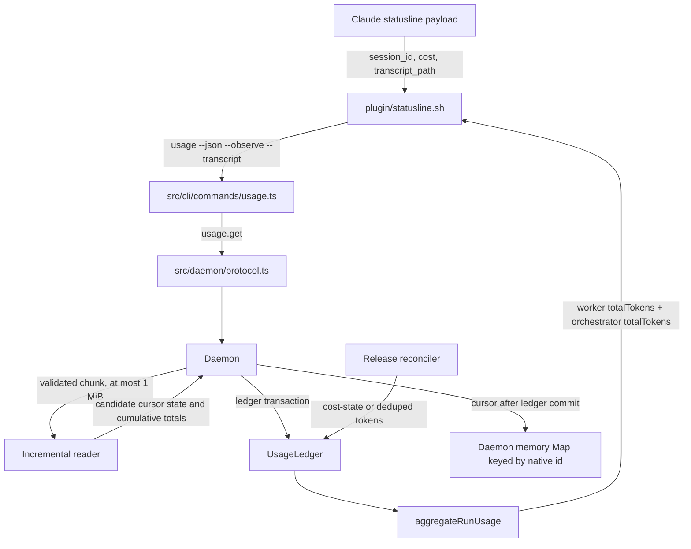

# Orchestrator live tokens design

**Spec**: `.specs/features/orchestrator-live-tokens/spec.md`
**Status**: Draft

---

## Architecture overview

The statusline sends Claude's `session_id` and `transcript_path` through the existing `usage` command. The CLI forwards the transcript observation alongside the cost observation in one `usage.get` request. The daemon resolves and validates the path, reads at most 1 MiB, and keeps its live cursor and dedupe state in a `Map` keyed by native id. It submits cumulative token values through the existing usage ledger. Release-time transcript reconciliation uses the same source key and per-field high-water marks. If a run query fails while `CODEDECK_RUN_ID` is set, the statusline omits `tok` rather than showing the smaller context-window snapshot.



The statusline gives the usage command a one-second timeout (`plugin/statusline.sh:193-199`), and `buildSettings` requests a two-second refresh (`src/open/launchers/claude.ts:121-139`). After a daemon restart, a large transcript is reread from byte zero in 1 MiB requests. A 30 MB transcript therefore takes about 30 refreshes, roughly one minute, to catch up. During that time the persisted usage ledger ignores lower partial token totals until each field passes its high-water mark, so the displayed total does not drop. Earlier native ids must not block the live request while their full transcripts are reconciled.

## Code reuse analysis

### Existing components to reuse

| Component | Location | How to use |
| --- | --- | --- |
| Statusline usage invocation | `plugin/statusline.sh:180-225` | Keep the current `usage <run-id> --json` call and cost observation. Add the transcript argument from the same payload. |
| Statusline token rendering | `plugin/statusline.sh:248-257` | Replace the worker-only total with the worker and orchestrator `totalTokens` fields. Keep the local context snapshot only when no run id is set. |
| Usage CLI parser | `src/cli/commands/usage.ts:15-45,157-163` | Preserve `--observe <native-id>=<cost>` and add `--transcript <native-id>=<path>`. Forward both values on one `usage.get` request. |
| IPC request type | `src/daemon/protocol.ts:161-167` | Extend `GetUsageRequest.params` with `transcript?: { nativeId: string; path: string }`. |
| Daemon usage handler | `src/daemon/daemon.ts:1085-1127` | Reuse run lookup, open-row selection, cost observation, link creation, and final `aggregateRunUsage` call. Add validated incremental transcript ingestion before aggregation. |
| Usage ledger | `src/store/usage-ledger.ts:4-18,53-112` | Reuse independent cost, input, output, and cached high-water marks. Do not change its attribution formula. |
| Orchestrator source key | `src/core/usage-source.ts:20-22` | Use `openSourceKey(nativeId)`, which returns `claude-open:<native-id>`, for both live and release observations. |
| Release transcript reconciliation | `src/daemon/daemon.ts:342-378` | Keep full transcript reads. Their values enter `UsageLedger.observe` with the same source key as live observations. |
| Full transcript parser | `src/core/claude-transcript.ts:88-167` | Reuse the existing assistant usage mapping and `message.id` plus `requestId` dedupe rule. Add a pure chunk consumer for live reads without changing release behavior. |
| Run usage summary | `src/core/run-usage.ts:15-35,79-97` | Use the merged branch's worker `totalTokens` and `orchestrator.totalTokens` fields. Do not add cached tokens a second time. |

There is no transcript cursor store. The feature adds no SQLite tables or cursor-store module. Existing SQLite usage-ledger rows continue to hold high-water marks.

### Integration points

| System | Integration method |
| --- | --- |
| Claude statusline | Pass `--transcript <session_id>=<transcript_path>` with the existing cost observation when both payload fields are valid. The statusline uses an argument array, so the path does not pass through a shell. |
| Usage CLI and IPC | Parse `--transcript` by splitting at the first `=` so the rest of a path is preserved. Send `transcript: { nativeId, path }` and the cost observation separately in one `usage.get` request. |
| Claude projects directory | Resolve the supplied path and `~/.claude/projects` with `realpath`. Require the resolved file to be under the resolved projects root, have basename `<native-id>.jsonl`, and be a regular file. A symlink is allowed when its resolved target passes these checks. Use a cheap stat of device, inode, and size to detect replacement or truncation. Do not reject symlink components individually, use no-follow open flags, or compare an opened descriptor's identity with the validated stat. |
| Live reader state | Store the byte offset, pending line, file device/inode, cumulative token totals, and seen message keys in daemon memory in a `Map` keyed by native id. Keep an oversize-line skip flag alongside that state. On daemon restart, initialize at byte zero and reread in capped chunks. |
| Cursor lifetime | Process live transcript requests only for active Claude `open` rows, rechecking status inside the per-native-id serializer. After a successful full release pass, queue cleanup for every linked native id through the same serializer. Remove a cursor only when no active Claude `open` row remains linked to it; retain all cursors if the pass fails and retain any shared active id. |
| Usage ledger | Send cumulative input, output, and cached tokens with `openSourceKey(nativeId)`. The ledger retains independent high-water values across requests and daemon restarts. |
| Release reconciliation | Continue to read the full transcript. Pass `cost-state` totals or fallback deduped assistant totals through the same `claude-open:<native-id>` source. The ledger adds only any positive difference above its marks. |

The daemon and statusline run as the same local user. A client able to send a malicious transcript path can already read that file. The realpath containment, basename, and regular-file checks keep a transcript observation within the expected Claude project tree. Per-component symlink rejection and no-follow descriptor verification do not add a meaningful privilege boundary for this local process pair.

Live ingestion sums newly seen `assistant.message.usage` records. Release reconciliation uses `cost-state.modelUsage` when present and otherwise uses deduplicated assistant records (`src/core/claude-transcript.ts:42-67,113-167`). These snapshots can differ. Since the ledger tracks input, output, and cached tokens independently, the final row can contain the maximum observed value for each field even when those maxima came from different snapshots. The design prevents double counting and prevents a release value from lowering a live mark. It does not promise that the final field tuple matches one `cost-state` snapshot when the sources disagree.

The existing statusline fallback remains when `CODEDECK_RUN_ID` is absent. For an active run whose CLI query fails, the statusline omits `tok`. The cost value still comes from `payload.cost.total_cost_usd`; storage and attribution follow the orchestrator usage specification.

## Components

### Statusline script

- **Purpose**: send the transcript path with the live orchestrator observation and display the combined run token total.
- **Location**: `plugin/statusline.sh`
- **Interface**: `codedeck usage <run-id> --json [--observe <native-id>=<cost>] [--transcript <native-id>=<path>]`
- **Behavior**: pass `--transcript` only when `session_id` and `transcript_path` are non-empty and the session id matches the existing Claude native-id format. When both `summary.totalTokens` and `summary.orchestrator.totalTokens` are finite, non-negative numbers, render their sum. If either value is absent, nonnumeric, non-finite, or negative, omit `tok` for that refresh. With `CODEDECK_RUN_ID` set, also omit `tok` when the query fails or the summary fails validation. Use the local context token fallback only when no run id is set.
- **Dependencies**: Claude's statusline stdin payload and `CODEDECK_RUN_ID`.
- **Reuses**: current cost observation, one-second timeout, ANSI formatting, and local token fallback.

### Usage CLI and IPC protocol

- **Purpose**: carry a transcript observation from the statusline to the daemon without changing cost observation semantics.
- **Location**: `src/cli/commands/usage.ts` and `src/daemon/protocol.ts`
- **Request interface**:
```typescript
export interface GetUsageRequest {
  method: "usage.get";
  params: {
    runId: string;
    observe?: { nativeId: string; costUsd: number };
    transcript?: { nativeId: string; path: string };
  };
}
```
- **Behavior**: parse `--transcript` by splitting at the first `=` so paths containing `=` remain intact. Forward transcript and cost observations separately in one request. The daemon rejects transcript ingestion when both observations have different native ids.
- **Dependencies**: existing `usage.get` request and `RunUsageSummary`.
- **Reuses**: `parseUsageObservation`, `IpcClient`, and the merged `RunUsageSummary` type.

### Daemon transcript ingestion

- **Purpose**: validate a transcript path, read a bounded chunk, and submit cumulative token totals before returning run usage.
- **Location**: `src/daemon/daemon.ts`, next to the `usage.get` handler.
- **In-memory state**:
```typescript
interface LiveTranscriptCursor extends IncrementalTranscriptState {
  byteOffset: number;
  device: number;
  inode: number;
}

private readonly liveTranscriptCursors = new Map<string, LiveTranscriptCursor>();
```
- **Behavior**:
  1. Find the `origin = 'open'` Claude row for the requested run. Preserve existing cost-observation handling for that row, but process its transcript only while the row is active.
  2. Validate a present `observe` value using the existing strict behavior. A malformed cost observation returns `INVALID` before transcript processing. If `observe` is valid, apply it independently even if transcript processing is rejected; if it is absent, continue with transcript processing without a cost observation.
  3. If `transcript` is present but is not an object with non-empty string `nativeId` and `path` fields, ignore the transcript portion and continue the request. Do not return `INVALID` or suppress a valid cost observation.
  4. Reject a transcript observation whose native id differs from the cost observation's native id when both are present.
  5. Resolve the real projects root and the real transcript path. Require the resolved path to be a descendant of the root, its basename to equal `<native-id>.jsonl`, and `stat` to report a regular file. Accept symlink paths only when their resolved target passes these checks.
  6. Open the resolved path without `O_NOFOLLOW` or a post-open device/inode comparison. If validation or open fails, leave the cursor and token observations unchanged. A valid cost observation remains applied.
  7. Serialize transcript processing by native id. Recheck that the open row is still active inside the serialized section before linking or reading. If it became terminal while the request waited, skip transcript ingestion and continue to aggregation. Link a valid native id before reading, even when the request has no cost observation. Do not create a link for a rejected path unless the independent cost path already created it.
  8. Read at most `TRANSCRIPT_CHUNK_LIMIT_BYTES` new bytes for the native id. Use the same per-id serializer for reads, cursor replacement, and release cleanup so a post-release request cannot recreate a cursor after cleanup and an in-flight read finishes before cleanup.
  9. Pass the bytes to the pure chunk consumer. Parse complete newline-terminated assistant records and retain the final partial line in memory. Skip invalid complete JSON lines and ignore `cost-state` during live token ingestion.
  10. Submit cumulative token fields through `UsageLedger.observe` with `openSourceKey(nativeId)` inside a SQLite transaction for the ledger writes. Commit the ledger transaction, then replace the in-memory cursor. The cursor is never part of a SQLite transaction. If ledger persistence fails, keep the previous cursor so the next request rereads the bytes.
  11. If linking the id returns earlier unreconciled ids, send the live response first and queue their full transcript reconciliation afterward. The durable link state lets release or startup retry if the daemon stops before the queued reads finish.
  12. Make `reconcileOpenUsageSafely` return a success boolean for the requested pass: `true` when it returns normally, including when a vanished transcript is marked `missing` or was already reconciled; `false` when reconciliation or ledger persistence throws and the error is logged (`src/daemon/daemon.ts:381-390`). Only the full `session.release` pass may use `true` to consider cursor cleanup, not the selected earlier-id pass from `usage.get`. After a successful full release pass, get every native id linked to the released session and queue each cursor cleanup through that id's serializer. Remove a cursor only when no active Claude `open` row remains linked to that id. If the full pass fails, retain all cursors, including those whose individual link was reconciled before the failure. Use `SessionStore.listActive` and `NativeLinkStore.linksFor` for this check (`src/store/sessions.ts:213-217`; `src/store/native-links.ts:67-77`).
  13. Return `aggregateRunUsage` even when transcript validation fails. Keep a valid cost observation from the same request.

### Incremental transcript reader

- **Purpose**: process new transcript bytes while preserving the existing token mapping and dedupe behavior.
- **Location**: `src/core/claude-transcript.ts`
- **Interface**:
```typescript
export const TRANSCRIPT_CHUNK_LIMIT_BYTES = 1_048_576;
export const TRANSCRIPT_PENDING_LINE_LIMIT_BYTES = 4_194_304;

export interface IncrementalTranscriptState {
  pendingLine: Uint8Array;
  discardUntilNewline: boolean;
  inputTokens: number;
  outputTokens: number;
  cachedTokens: number;
  seenMessageKeys: Set<string>;
}

export function consumeTranscriptChunk(
  state: IncrementalTranscriptState,
  bytes: Uint8Array,
): IncrementalTranscriptState;
```
- **Behavior**:
  - Reject a chunk larger than `TRANSCRIPT_CHUNK_LIMIT_BYTES` with `RangeError` and leave the supplied state unchanged.
  - Parse newline-terminated records only. Keep the final fragment until a later chunk completes the line.
  - If a pending line grows beyond `TRANSCRIPT_PENDING_LINE_LIMIT_BYTES`, drop it and ignore bytes through its next newline. Continue parsing after that newline.
  - Skip complete invalid JSON lines.
  - Read `message.usage` from assistant records. Count input, output, cache-read, and cache-creation values using the existing mapping in `src/core/claude-transcript.ts:113-135`.
  - Store `JSON.stringify([message.id, requestId])` when both ids are present. Ignore a keyed record already in `seenMessageKeys`. Records missing either id keep the existing one-pass behavior.
  - Return a new state without mutating the input state or its `Set`.

### Usage ledger and release reconciliation

- **Purpose**: keep live and release transcript values on the same per-native-id high-water source.
- **Location**: existing `src/store/usage-ledger.ts` and the transcript reconciler in `src/daemon/daemon.ts`.
- **Behavior**: the ledger tracks cost, input, output, and cached marks independently. A lower or equal cumulative field adds nothing. A higher field adds only the positive difference to its linked row. Live and release observations both use `claude-open:<native-id>`.
- **Reuses**: `UsageLedger.observe` and `openSourceKey`.

## Data models

```typescript
interface LiveTranscriptCursor extends IncrementalTranscriptState {
  byteOffset: number;
  device: number;
  inode: number;
}

const liveTranscriptCursors = new Map<string, LiveTranscriptCursor>();
```

The map key is the native id. The cursor stores the offset after every byte read, including bytes held in `pendingLine`. It keeps cumulative input, output, and cached totals plus the set of keyed assistant records already counted. The current file stat supplies `device`, `inode`, and `size`. The map stores device and inode; each request compares the current size with the saved offset.

Live transcript ingestion runs only for an active Claude `open` row. The handler checks that status again inside the per-native-id serializer, before it links the id or reads. The serializer covers transcript reads, cursor replacement, and release cleanup. A request that waits behind release therefore sees a terminal row and skips ingestion; a request already reading completes before release cleanup.

After a full release reconciliation returns successfully, queue cleanup for every native id linked to that session through its per-id serializer. `reconcileOpenUsageSafely` returns `true` when `reconcileOpenUsage` completes without throwing, including when a vanished transcript is durably marked `missing` or its link already has a reconciled state. It returns `false` when reconciliation or ledger persistence throws and the error is logged. If it returns `false`, retain all cursors even if some links were reconciled before the error. For each id after a `true` full pass, remove its cursor only when no active Claude `open` row remains linked to it. This frees pending bytes and seen keys for released sessions without making a shared live id rescan unnecessarily.

The reader counts only complete assistant records. `cachedTokens` is cache-read plus cache-creation input tokens. The statusline gets the combined total from the run summary, where the pricing helper has already applied the harness cache-counting rule.

On daemon restart, the map starts empty. The first live request starts at byte zero and reads at most 1 MiB. Lower partial observations do not change existing ledger marks. As the reread passes each mark, the ledger attributes only the new difference. A roughly 30 MB transcript therefore catches up over about one minute of two-second refreshes without lowering the displayed total.

## Error handling

| Error scenario | Handling | User impact |
| --- | --- | --- |
| `transcript_path` is missing | Skip transcript reading and return the stored run summary. | Existing totals remain visible. |
| Resolved path is outside the projects root, has the wrong basename, or is not a regular file | Do not read it or change the cursor. Continue a valid cost observation and return the current summary. | Tokens may remain stale for this refresh; the statusline still runs. |
| `transcript` has the wrong runtime shape | Ignore the transcript parameter, keep the cursor unchanged, apply a valid cost observation, and return the current summary. | A malformed transcript value does not reject the whole `usage.get` request. |
| `observe` has the wrong runtime shape while `transcript` is valid | Preserve the existing strict validation: return `INVALID` before transcript processing. | A malformed cost observation does not create a transcript link or advance a cursor. |
| A `usage.get` transcript request reaches a terminal Claude `open` row | Skip transcript linking and ingestion after checking status inside the per-id serializer. Preserve the current cost path and return the current summary. | Post-release statusline refreshes do not recreate a live cursor. |
| Opening the validated real path fails | Do not change the cursor or token observations. Keep a valid cost observation and return the current summary. | Tokens may remain stale for this refresh. |
| Transcript ends with an incomplete line of at most 4 MiB | Keep its bytes in memory and resume them on the next request. | Only complete records affect totals. |
| Incomplete line grows beyond 4 MiB | Drop the fragment and skip bytes through its next newline. | That live record is omitted; later records still count. |
| Complete line contains invalid JSON | Skip that line and advance the cursor. | Later valid lines still count. |
| A keyed assistant record repeats in a later chunk | Ignore the repeated `(message.id, requestId)` key. | The record contributes once while the daemon is live. |
| Transcript exceeds the per-request byte cap | Commit the ledger observation, then advance the in-memory cursor and continue at the next statusline request. | Large transcripts show partial totals that rise over later refreshes. |
| Daemon restarts during a live session | Start the reader at byte zero and replay in 1 MiB chunks; keep existing ledger high-water marks. | Displayed totals do not drop while the transcript catches up. |
| Ledger observation fails after parsing | Keep the previous in-memory cursor and retry those bytes on the next request. | The next request can process the uncommitted chunk. |
| Usage invocation reaches one second or fails during an active run | The statusline catches the failure, omits `tok`, and prints remaining local fields. | Claude's prompt remains usable without showing a lower context-window value as the run total. |
| A run summary has missing or invalid worker/orchestrator `totalTokens` | Omit `tok` for that refresh when `CODEDECK_RUN_ID` is set. | The statusline does not show a partial sum or fall back to the smaller context-window snapshot. |
| Release reconciliation sees values already observed live | Apply the same source high-water marks independently to each token field. | Equal or lower values add nothing; a higher release value adds only the difference. A final tuple can combine per-field maxima from live and release snapshots. |
| A new live native id has earlier unreconciled ids | Send the live response, then queue the earlier ids' full reads. | The statusline's one-second budget is not spent on an unbounded earlier transcript. |

## Risks and limits

| Concern | Location (file:line) | Impact | Handling |
| --- | --- | --- | --- |
| The statusline supplies a filesystem path to the daemon. | `plugin/statusline.sh:184-198`; `src/daemon/daemon.ts:1085-1127` | An unchecked path could make the daemon read an arbitrary local file. | Resolve the path and root, then require containment, the expected basename, and a regular file. The statusline and daemon run as the same local user, so per-component symlink rejection and post-open descriptor identity checks are unnecessary for this boundary. |
| A large transcript must be reread after daemon restart. | `src/core/claude-transcript.ts:88-95`; `plugin/statusline.sh:193-199` | A 30 MB transcript takes about one minute of two-second refreshes to catch up. | Keep each request to 1 MiB. The ledger high-water marks keep the displayed total from dropping. |
| The seen-key set lives in daemon memory. | `src/core/claude-transcript.ts:122-128` | A restart loses the cursor and dedupe set. | Reread from byte zero. Cumulative ledger marks ignore lower partial totals until reread catches up. |
| A cursor keeps state after its session ends. | `src/daemon/daemon.ts` release reconciliation | Pending bytes and seen keys would remain in memory after they are no longer useful. | After a successful full pass, serialize cleanup for every id linked to the released session and delete each cursor only when no active Claude `open` row remains linked to it. A failed pass retains all cursors. |
| A statusline request overlaps release or arrives after release. | The live reader and `session.release` handler | A late request could recreate a cursor after cleanup, or an in-flight read could finish after cleanup. | Recheck activity inside the per-id serializer. After a successful full release pass, queue cleanup for every linked id in that serializer. A failed pass retains every cursor. |
| An active transcript's seen-key set grows with its keyed assistant records. | Live `Map` cursor | Memory use grows with the transcript while an `open` row still uses the native id. | Keep the keys needed for dedupe while the id is active, then remove the cursor after the last linked active row is reconciled. |
| A same-device, same-inode rewrite can keep a size at least as large as the saved offset. | The in-memory cursor uses stat device, inode, and size. | Such a rewrite is not detected and may leave live totals stale. | Reset only when device/inode changes or size falls below the saved offset. Release reconciliation still reads the full transcript. |
| An incomplete JSONL line exceeds the 4 MiB cap. | Incremental transcript reader | The live reader drops that line and skips to its newline. | Bound retained memory; later complete records continue to count. |
| A request links an id with prior native sessions. | `src/daemon/daemon.ts:1113-1120` | Full reads of earlier transcripts can exceed the statusline budget. | Send the live response first and queue prior-id reconciliation afterward. |

## Technical decisions

| Decision | Choice | Rationale |
| --- | --- | --- |
| CLI argument for transcript path | `--transcript <native-id>=<path>` | Keeps the current cost flag stable and passes the path as an argument instead of through a shell. |
| Allowed path | A regular file below the real `~/.claude/projects` root whose resolved basename is `<native-id>.jsonl` | Matches Claude's transcript layout and keeps observations inside the expected project tree. |
| Symlink handling | Resolve the root and file, then validate the resolved path. Do not reject each symlink component or compare an opened descriptor's identity. | The daemon and statusline run as the same local user; a malicious-path caller can already read the file. |
| Read bound | 1,048,576 new bytes per native id per `usage.get` request | Keeps each statusline refresh bounded and resumes on the next two-second refresh. |
| Live cursor and dedupe state | Store offset, partial line, device/inode, cumulative totals, and seen keys in daemon memory keyed by native id. | Restarting the daemon begins at byte zero; the persisted usage ledger preserves displayed high-water totals during reread. |
| Oversized partial line | Retain at most 4 MiB. Drop a fragment that grows beyond the cap and skip to its next newline. | Prevents one unterminated record from growing without bound in memory. |
| Live and release source | `claude-open:<native-id>` for both paths | Existing per-field high-water marks absorb overlap without changing the orchestrator usage contract. |
| Statusline token total | `summary.totalTokens + summary.orchestrator.totalTokens` | The merged usage summary already applies the harness-specific cache-counting rule. |
| Token values disagree at release | Keep each field's high-water maximum across live and release observations. | This avoids double counting and prevents lower release values from reducing a live total. A final tuple can combine fields from different snapshots. |
| Prior native id reconciliation during `usage.get` | Queue full prior-id reads after sending the live response. | The statusline's one-second budget covers bounded live ingestion only; durable link state supports retry. |

## Open questions

| Question | Current behavior | Why it remains open |
| --- | --- | --- |
| Which Claude Code version first provides `transcript_path`? | Skip live reading when the field is absent. | The current statusline documentation lists the field but does not state the first supported version. |
| Should assistant usage lines missing `message.id` or `requestId` get a fallback dedupe key after a transcript rewrite? | Preserve the current rule and dedupe only when both fields are present. | The existing reader does not define a stable identity for those lines. |
| Is 1,048,576 bytes enough for each two-second refresh on slower disks? | Keep the fixed cap and let later refreshes continue. | No latency measurement was requested or run for this documentation task. |
