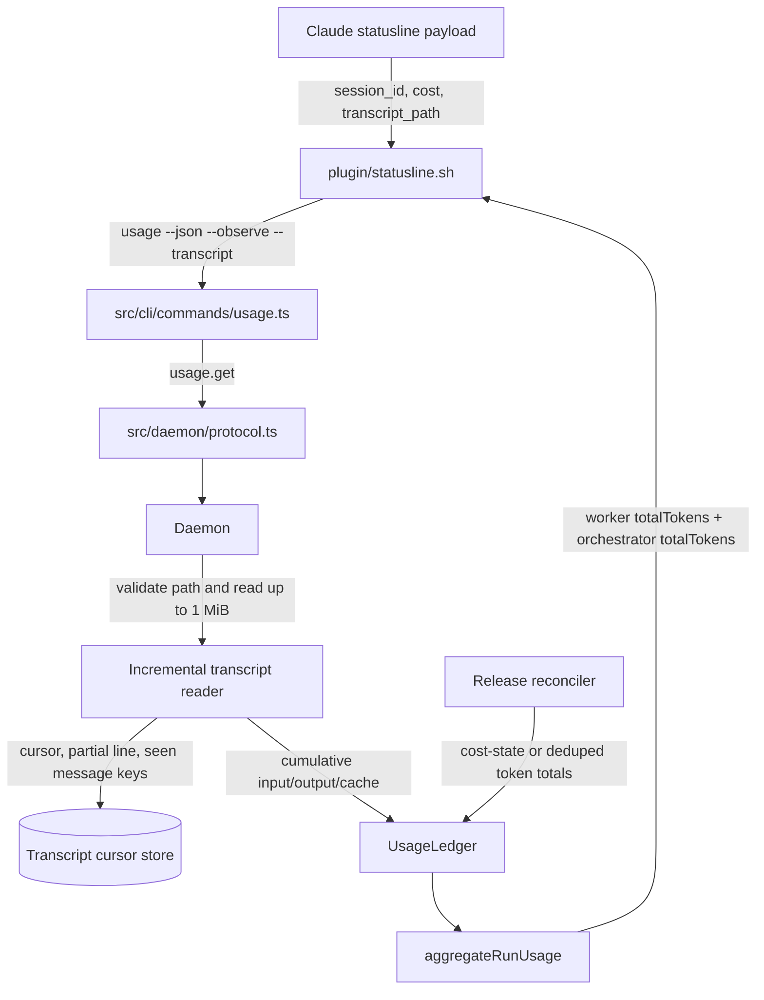

# Orchestrator live tokens design

**Spec**: `.specs/features/orchestrator-live-tokens/spec.md`
**Status**: Draft, awaiting spec approval

---

## Architecture overview

The statusline sends Claude's `session_id` and `transcript_path` through the existing `usage` command. The CLI forwards the transcript observation in the same `usage.get` request as the existing cost observation. The daemon validates and safely opens the path, reads a bounded chunk, persists the cursor and dedupe state, and sends cumulative token totals through the existing usage ledger. The release-time transcript reconciliation uses the same source key and per-field high-water marks. If a run query fails, the statusline omits `tok` for that refresh instead of replacing the aggregate with a smaller context-window snapshot.



The statusline already gives the usage command a one-second timeout (`plugin/statusline.sh:193-199`), and `buildSettings` requests a two-second refresh (`src/open/launchers/claude.ts:121-139`). A first read of a large transcript can therefore return a partial cumulative total. The next refresh continues from the stored offset. Full reconciliation of earlier native ids must not block this live request.

## Code reuse analysis

### Existing components to leverage

| Component | Location | How to use |
| --- | --- | --- |
| Statusline usage invocation | `plugin/statusline.sh:180-225` | Keep the current `usage <run-id> --json` call and cost observation. Add a transcript argument from the same payload. |
| Statusline token rendering | `plugin/statusline.sh:248-256` | Replace the worker-only sum with the worker and orchestrator `totalTokens` fields. Keep the local context snapshot for degraded mode only. |
| Usage CLI parser | `src/cli/commands/usage.ts:36-45,157-163` | Preserve `--observe <native-id>=<cost>` and add `--transcript <native-id>=<path>`. Forward both values on one `usage.get` request. |
| IPC request type | `src/daemon/protocol.ts:161-167` | Extend `GetUsageRequest` with an optional transcript observation `{ nativeId, path }`. |
| Daemon usage handler | `src/daemon/daemon.ts:1085-1127` | Reuse run lookup, native link creation, cost observation, transaction boundary, and final `aggregateRunUsage` call. Add validated incremental transcript ingestion before aggregation. |
| Usage ledger | `src/store/usage-ledger.ts:4-10,56-105` | Reuse its independent cost, input, output, and cached high-water marks. No new attribution formula is needed. |
| Orchestrator source key | `src/core/usage-source.ts:20-22` | Use `openSourceKey(nativeId)`, which returns `claude-open:<nativeId>`, for both live and release observations. |
| Release transcript reconciliation | `src/daemon/daemon.ts:342-378` | Keep the final `cost-state` or fallback token observation on the same source key as the live reader. |
| Full transcript parser | `src/core/claude-transcript.ts:88-167` | Reuse the existing assistant usage mapping and `message.id` plus `requestId` dedupe rule. Add incremental state instead of changing release behavior. |
| SQLite migration pattern | `src/store/database.ts:97-126` | Add cursor and message-key tables next to the existing usage ledger tables. |
| Run usage summary | `src/core/run-usage.ts:15-34,54-72` | The current checked-in shape has input, output, and cached fields but not `totalTokens`. This feature assumes the parallel change adds worker and orchestrator `totalTokens`, as required by the briefing. |

### Integration points

| System | Integration method |
| --- | --- |
| Claude statusline | Pass `--transcript <session_id>=<transcript_path>` with the existing cost observation when the payload fields are valid. `execFileSync` receives an argument array, so the path does not pass through a shell. |
| Usage CLI and IPC | Parse the native id and path into `transcript: { nativeId, path }` and include it in `usage.get`. Keep cost as the existing independent `observe` property. |
| Claude projects directory | Resolve the reported file and its parent before opening it. Require the real path to be a direct project transcript under `~/.claude/projects`, a regular file, and named `<nativeId>.jsonl`. Reject symlink components below the resolved projects root. Open the validated file without following symlinks, verify the opened file descriptor's device and inode against the validated file, and read from that same handle. |
| SQLite | Persist the byte cursor, trailing partial line, cumulative token totals, and seen message keys. Keep these separate from `usage_sources` and `usage_attributions`. |
| Release reconciliation | Continue to read the full transcript. Its values enter `UsageLedger` with `openSourceKey(nativeId)`, which applies only any positive delta above the mark already created by live observations. |

The existing `UsageLedger` can accept incremental token observations without changing the orchestrator usage requirements. ORCH-04 records live cost. ORCH-05 through ORCH-08 produce final transcript observations. ORCH-13 through ORCH-15 specify the per-field high-water behavior. The daemon currently sends release totals through `openSourceKey` and `UsageLedger.observe` (`src/daemon/daemon.ts:361-371`), and the ledger already maintains separate high-water fields (`src/store/usage-ledger.ts:46-105`). No existing ORCH acceptance criterion needs to change.

Live ingestion sums deduplicated `assistant.message.usage` records. Release reconciliation uses `cost-state.modelUsage` when present and otherwise uses the deduplicated assistant records (`src/core/claude-transcript.ts:42-67,113-167`). Those token snapshots can differ. Because the ledger high-water is independent for input, output, and cached tokens, the final row can contain the maximum observed value for each field, even when those maxima came from different snapshots. The design prevents double counting and prevents a release value from lowering a live mark. It does not promise that the final field tuple exactly matches one `cost-state` snapshot when the two sources disagree.

The existing statusline spec's local token fallback remains when `CODEDECK_RUN_ID` is absent. For an active run whose CLI query fails, this design supersedes that spec's local-token fallback in criteria 9 and 11 and omits `tok`. The cost value still comes from `payload.cost.total_cost_usd`; storage and attribution follow the orchestrator usage specification.

## Components

### Statusline script

- **Purpose**: send the transcript path with the live orchestrator observation and display the combined run token total.
- **Location**: `plugin/statusline.sh`
- **Interface**: `codedeck usage <run-id> --json [--observe <native-id>=<cost>] [--transcript <native-id>=<path>]`
- **Behavior**: pass `--transcript` only when both `session_id` and `transcript_path` are non-empty and the session id matches the existing Claude native-id format. When summary data is available, render `summary.totalTokens + summary.orchestrator.totalTokens`. If `CODEDECK_RUN_ID` is set but the query fails, omit `tok` instead of showing local `context_window` tokens. If no run id is set, keep the local statusline fallback.
- **Dependencies**: Claude's statusline stdin payload and `CODEDECK_RUN_ID`.
- **Reuses**: current cost observation, one-second timeout, ANSI formatting, and local token fallback.

### Usage CLI and IPC protocol

- **Purpose**: carry a transcript observation from the statusline to the daemon without changing cost observation semantics.
- **Location**: `src/cli/commands/usage.ts`, `src/daemon/protocol.ts`
- **Interface**: `GetUsageRequest.params.transcript?: { nativeId: string; path: string }`.
- **Behavior**: parse `--transcript` by splitting at the first `=` so paths containing `=` remain intact. Forward the transcript and cost observations separately in the same `usage.get` request. The daemon rejects a transcript observation whose native id differs from the cost observation when both are present.
- **Dependencies**: existing `usage.get` request and response.
- **Reuses**: `parseUsageObservation`, `IpcClient`, and `RunUsageSummary`.

### Daemon transcript ingestion

- **Purpose**: validate the transcript path, read a bounded chunk, and submit cumulative token totals before returning run usage.
- **Location**: `src/daemon/daemon.ts`, next to the `usage.get` handler.
- **Interface**: private handler that accepts `{ runId, nativeId, path }` and returns the existing `RunUsageSummary` after ingestion.
- **Behavior**:
  1. Find the `origin = 'open'` Claude row for the requested run, as the cost path does today.
  2. Apply a valid cost observation through the existing path. If the request has no cost observation, continue with transcript processing.
  3. Resolve the allowed projects root and canonical file path. Reject paths outside the root, symlink components below the root, non-regular files, paths whose basename does not equal `<nativeId>.jsonl`, and native-id mismatches.
  4. Open the validated canonical path with no-follow semantics. Verify `fstat` reports a regular file with the same device and inode as the validated path. Reject the transcript read if either check fails, and read from that same file handle without reopening the path.
  5. Link a valid transcript native id to the open row before reading, even when the request has no cost observation. Do not create a link for a rejected path unless the independent cost path already created it.
  6. Read at most 1,048,576 new transcript bytes for that native id. Parse complete JSONL records and retain any trailing partial line.
  7. Convert newly seen assistant usage records into cumulative input, output, and cached totals. Ignore `cost-state` during live token ingestion because release reconciliation reads it as a separate snapshot.
  8. In one SQLite transaction, persist the cursor and dedupe keys and call `UsageLedger.observe` with the cumulative token fields and `openSourceKey(nativeId)`.
  9. If linking this id returns earlier unreconciled ids, queue their full transcript reconciliation after the live `usage.get` response. The durable link state lets the existing release or startup path retry if the daemon stops before the queued reads finish.
  10. Return `aggregateRunUsage` even when transcript validation fails. A valid cost observation in the same request still applies.
- **Dependencies**: `SessionStore`, `NativeLinkStore`, `UsageLedger`, the transcript cursor store, and `aggregateRunUsage`.
- **Reuses**: the existing open-row lookup and native link behavior in `usage.get`.

### Incremental transcript reader

- **Purpose**: process only new transcript bytes while preserving the existing token mapping and dedupe behavior.
- **Location**: `src/core/claude-transcript.ts`
- **Interface**: an incremental reader that accepts a validated file, byte offset, trailing bytes, cumulative totals, and previously seen message keys, then returns the new cursor state and cumulative totals.
- **Behavior**:
  - Read no more than 1,048,576 bytes from the saved offset.
  - Parse newline-terminated records only. Keep the final fragment until the next read completes the line.
  - Skip complete lines that are invalid JSON, matching `readTranscriptUsage` today.
  - Read `message.usage` from assistant records. Count input, output, cache-read, and cache-creation values using the existing mapping at `src/core/claude-transcript.ts:113-135`.
  - Persist `message.id` plus `requestId` keys across batches. Add a keyed record only when the pair has not been seen for that native id.
  - Preserve cumulative totals across statusline refreshes, daemon restarts, and context compaction. If the file's device or inode changes, or its size falls below the saved offset, restart scanning at byte zero and clear the pending fragment without clearing cumulative totals or seen keys.
  - The daemon serializes chunk ingestion per native id so two overlapping requests cannot move the saved cursor backward.
  - Assistant records missing either `message.id` or `requestId` keep the existing one-pass behavior. If a changed or shortened transcript forces a rescan, such records can be counted again. The open question in the spec asks whether a fallback identity should replace this behavior.
  - The per-request byte cap bounds newly read transcript bytes. It does not set a maximum JSONL line length, so a partial line can grow across refreshes until that decision is made.
- **Dependencies**: validated transcript path and cursor state.
- **Reuses**: `tokenCount`, assistant message parsing, and the current composite dedupe key.

### Transcript cursor store

- **Purpose**: make incremental parsing resumable and safe to replay after process or daemon restarts.
- **Location**: new store module under `src/store/`, with tables created by `src/store/database.ts`.
- **Interface**:
  - `get(nativeId): TranscriptCursor | undefined`
  - `saveChunk(nativeId, state, seenMessageKeys): void`
  - `hasMessage(nativeId, messageId, requestId): boolean`
- **Dependencies**: the existing SQLite database handle.
- **Reuses**: the migration pattern used by `usage_sources` and `usage_attributions`.
- **Transaction rule**: the cursor update, new message keys, cumulative totals, and `UsageLedger.observe` commit together. A crash before commit leaves the previous cursor in place, so the next request rereads the same bytes.

## Data models

```typescript
interface TranscriptCursor {
  nativeId: string
  canonicalPath: string
  deviceId: string
  inode: string
  byteOffset: number
  pendingLine: Uint8Array
  inputTokens: number
  outputTokens: number
  cachedTokens: number
}

interface TranscriptMessageKey {
  nativeId: string
  messageId: string
  requestId: string
}

interface TranscriptObservation {
  nativeId: string
  path: string
}
```

`TranscriptCursor` is keyed by `nativeId`. `TranscriptMessageKey` has a composite key of `nativeId`, `messageId`, and `requestId`. The reader stores the byte offset after the bytes it consumed, including an incomplete trailing line in `pendingLine`. Its cumulative totals count only complete assistant records processed at that point.

The run summary fields come from the parallel usage-summary change. `summary.totalTokens` is the worker total and `summary.orchestrator.totalTokens` is the orchestrator total. Each field counts cache tokens once according to the harness rule, so the statusline does not add `cachedTokens` again.

## Error handling strategy

| Error scenario | Handling | User impact |
| --- | --- | --- |
| `transcript_path` is missing | Skip transcript reading and return the stored run summary. | Existing totals remain visible. |
| Path is outside the resolved projects root, names another session, resolves to a non-regular file, or the opened file identity differs from the validated identity | Do not read it or change the cursor. Continue a valid cost observation and return the current summary. | Tokens may remain stale for this refresh; the statusline still runs. |
| Transcript contains an incomplete final line | Save its bytes and resume it on the next request. | Only complete records affect totals. |
| Transcript contains invalid JSON on a complete line | Skip that line and advance the cursor. | Later valid lines still count. |
| A keyed assistant record repeats in a later chunk | Ignore the repeated `(message.id, requestId)` key. | The record contributes once. |
| Transcript exceeds the per-request byte cap | Commit the processed portion and cursor, then continue at the next statusline request. | Large first reads can show partial totals that rise over later refreshes. |
| Usage invocation reaches one second or fails during an active run | The statusline catches the failure, omits `tok`, and prints the remaining local fields. | Claude's prompt remains usable without showing a lower context-window value as the run total. |
| Release reconciliation sees values already observed live | Apply the same source high-water marks independently to each token field. | Equal or lower values add nothing; a higher release value adds only the difference. A final tuple can combine per-field maxima from live and release snapshots. |
| A new live native id has earlier unreconciled ids | Queue their full reads after the `usage.get` response. | The statusline's one-second budget is not consumed by an unbounded earlier transcript. |

## Risks & Concerns

| Concern | Location (file:line) | Impact | Mitigation |
| --- | --- | --- | --- |
| The statusline supplies a filesystem path to the daemon. | `plugin/statusline.sh:184-198`; `src/daemon/daemon.ts:1085-1127` | An unchecked path could make the daemon read an arbitrary local file. | Canonicalize and validate the file under the projects root, reject symlink components below it, and require `<nativeId>.jsonl` before opening it. |
| Full transcript reads can exceed the statusline's one-second budget. | `src/core/claude-transcript.ts:88-95`; `plugin/statusline.sh:193-199` | A large initial read could prevent the statusline from returning. | Read at most 1 MiB per request and continue from a durable cursor. |
| Existing transcript dedupe state is process-local. | `src/core/claude-transcript.ts:92-93,122-128` | A duplicate in a later chunk or after daemon restart could count twice. | Persist the composite message keys by native id. |
| The native `context_window` counters can shrink after compaction. | `plugin/statusline.sh:133-157` | Using the current window as cumulative usage can lower or repeat the displayed total. | Derive orchestrator totals only from cumulative transcript usage and apply ledger high-water marks. |
| The current timeout fallback can replace run tokens with a smaller local context snapshot. | `plugin/statusline.sh:251-256` | The displayed total can drop for one refresh when the query fails. | When `CODEDECK_RUN_ID` is set and the summary is missing, omit `tok`. |
| A request can discover previous native ids and trigger a full-file reconcile. | `src/daemon/daemon.ts:1113-1120` | That read is not covered by the one-chunk live read bound and can exceed the statusline timeout. | Queue prior-id reconciliation after the live request responds. |
| Cursor and dedupe rows add durable per-session state. | New cursor store and tables | Rows may remain after transcripts are no longer available. | Do not delete cursor state before release reconciliation succeeds. Final retention and pruning policy remains an open question. |
| An incomplete JSONL record can span more than one read cap. | New cursor store and `src/core/claude-transcript.ts` | The stored partial line can grow beyond one MiB and may use more disk and parsing time than the request byte cap suggests. | Keep new file reads bounded; set a partial-line maximum or choose a streaming parser before Tasks. |

## Tech decisions

| Decision | Choice | Rationale |
| --- | --- | --- |
| CLI argument for transcript path | `--transcript <native-id>=<path>` | Keeps the current cost flag stable and can be passed in the same argument array without a shell. |
| Allowed path | A regular file under resolved `~/.claude/projects/<project>/` named `<native-id>.jsonl` | Matches the transcript layout used by the existing reader while preventing path traversal and symlink escapes. |
| Read bound | 1,048,576 new bytes per native id per `usage.get` request | The read stays bounded and resumes on the next two-second refresh. |
| Cursor and dedupe state | Persist byte offset, partial line, cumulative counters, and keyed assistant identities in SQLite | A later chunk or daemon restart must not lose the read position or dedupe history. |
| Live and release source | `claude-open:<nativeId>` for both paths | Existing high-water marks absorb overlap without changing the ORCH-04 through ORCH-08 contract. |
| Statusline token total | `summary.totalTokens + summary.orchestrator.totalTokens` | The summary owns harness-specific cache counting and already represents the run's two sources. |
| Token values disagree at release | Keep each field's high-water maximum across live and release observations. | The existing ledger tracks each field independently. This avoids double counting and prevents lower release values from reducing a live total, while acknowledging that token fields can come from different snapshots. |
| Prior native id reconciliation during `usage.get` | Queue full prior-id reads after sending the live response. | The statusline's one-second budget covers only bounded live ingestion; the existing durable link remains available for retry. |

`.specs/STATE.md` is absent in this checkout, so there were no active project-level decisions to apply.

## Open questions

| Question | Current behavior in this draft | Why it remains open |
| --- | --- | --- |
| Should the allowed projects root honor a non-default `CLAUDE_CONFIG_DIR`? | Accept only the resolved `~/.claude/projects` root and reject other paths. | Supporting another root changes the daemon's filesystem boundary. |
| Which Claude Code version is the minimum supported version for this feature? | Skip transcript reading when `transcript_path` is absent. | The current official documentation lists the field but gives no first-supported version. |
| Should assistant usage lines missing `message.id` or `requestId` get a fallback dedupe key after a transcript rewrite? | Preserve the existing rule and dedupe only when both fields are present. | The current reader does not define a stable identity for those lines. |
| Is 1,048,576 bytes enough for each two-second refresh on slower disks? | Use the proposed cap and let later refreshes continue. | No latency measurement was requested or run for this docs-only task. |
| What maximum JSONL line length should the incremental reader retain? | No maximum is set in this draft; the one MiB limit applies to new bytes read per request. | An incomplete line can continue to grow in the cursor across refreshes. |
| When can cursor and dedupe rows be pruned? | Retain them until release reconciliation succeeds. | Multiple open rows can share a native id, and their last reconciliation may happen at different times. |
| Should the cursor detect an in-place rewrite that preserves device, inode, and a size at least as large as its saved offset? | Detect device/inode changes and a file size below the saved offset. | The current draft does not compare transcript contents already read. |
