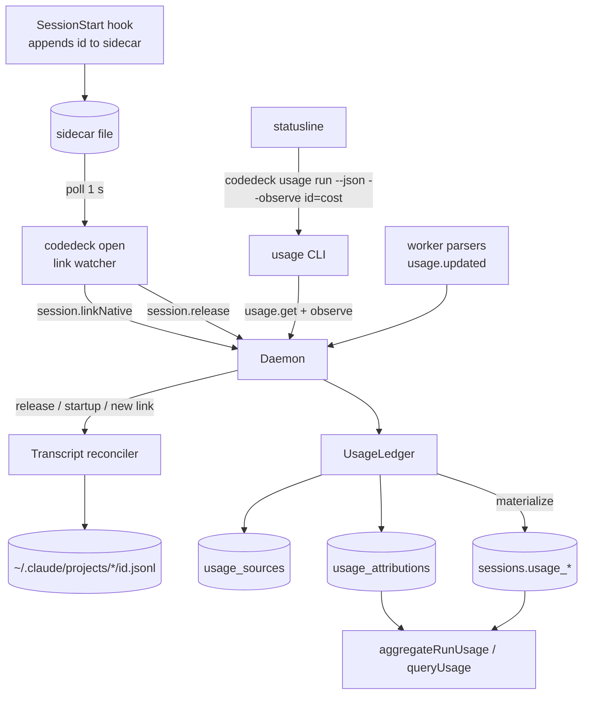

# Orchestrator Usage Design

**Spec**: `.specs/features/orchestrator-usage/spec.md`
**Status**: Approved (approach A, 2026-09-22)

---

## Approaches considered

All three deliver the same spec. They differ only in where the per-source state lives.

| | A. Ledger tables in SQLite (recommended) | B. JSON column per session row | C. Transcript-only reconcile |
| --- | --- | --- | --- |
| High-water per source | one row per source in `usage_sources`, global across rows | recomputed by scanning every row's JSON for the key | no live marks, cost-state read at release only |
| Live orchestrator cost | statusline observation lands in the store | same | none until release, so ORCH-04 and RUN-06 fail |
| Readers (`queryUsage`, `aggregateRunUsage`) | unchanged: attribution is materialized into `sessions.usage_*` | unchanged | unchanged |
| Cost of change | 3 small tables and one store module | one column, but a cross-row scan on every observation | smallest, but breaks the spec |

**Choice: A.** B needs a global lookup anyway, so it ends up as A with worse queries. C is only viable if ORCH-04 and RUN-06 leave the spec.

---

## Architecture Overview

Every harness counter becomes an **observation** `(row, sourceKey, fields)`. One store module, `UsageLedger`, applies the high-water rule and rewrites the row's `usage_*` columns as the sum of its attributions. Everything that reads usage today keeps reading those columns.



Flows:

1. **Link** (ORCH-01..03). The hook keeps writing the sidecar with `grep` + `printf`, but appends one id per line instead of overwriting. `open` polls the sidecar every second and sends `session.linkNative` for each id it has not sent yet. The hook never talks to the daemon, so ORCH-02 holds by construction.
2. **Live cost** (ORCH-04, RUN-06). The statusline adds `--observe <session_id>=<cost>` to the `codedeck usage` call it already makes. The daemon links the id (idempotent), applies the observation, then returns the aggregate in the same round trip.
3. **Reconcile** (ORCH-05..12, ORCH-16). On release of an `open` row, at daemon start for stale rows, and when a second id links, the daemon reads each unreconciled linked transcript and records its `cost-state` (or the token fallback) as an observation.
4. **Workers** (SRC-01..04). `updateSessionFromEvent` derives the source key from the row's agent and routes non-incremental `usage.updated` through the ledger. opencode deltas keep the current additive path.
5. **Read** (RUN-01..09). `aggregateRunUsage` splits rows by `origin`. `queryUsage` gains a `byOrigin` bucket and merges legacy entries (P2).

---

## Code Reuse Analysis

### Existing Components to Leverage

| Component | Location | How to Use |
| --- | --- | --- |
| Migration pattern | `src/store/database.ts:44-137` | new tables with `CREATE TABLE IF NOT EXISTS`, new indexes next to `idx_sessions_run_id` |
| Event dedup guard | `src/daemon/daemon.ts:1225-1236` | ledger writes run inside the existing `BEGIN`/`COMMIT`, only when `inserted !== 0`, so SRC-04 comes for free |
| Usage handler | `src/daemon/daemon.ts:1316-1350` | the non-incremental branch calls `UsageLedger.observe` instead of overwriting columns |
| Row usage columns | `src/store/sessions.ts` (`usage_*`) | materialization target, so `queryUsage` and `ps`/`show` need no change to see orchestrator cost |
| Pricing | `src/core/pricing.ts:137-166` | extend `computeSessionCost` with a `cachedInInput` flag; reuse `resolveModelPrice` for ORCH-09 |
| Run aggregate | `src/core/run-usage.ts` | split into worker and orchestrator partitions with the same summing loop |
| Startup recovery | `src/daemon/daemon.ts:169-200` | hook the stale-row reconcile after `recover()` |
| Release handler | `src/daemon/daemon.ts:508-545` | reconcile after `setStatus`, so ORCH-12 status is set first |
| Sidecar consumer | `src/open/runtime.ts:243` (`takeSessionId`) | read the last line for the resume hint; all lines are linked |
| Statusline shim tests | `tests/statusline.test.ts:22-85` | same PATH shim, assert the new argv and RUN-06 arithmetic |
| Daemon seam | `tests/helpers/daemon-seam.ts`, `tests/usage-daemon.test.ts` | drive `session.adopt`, `session.linkNative`, `usage.get` and `session.release` without spawning harnesses |
| Spawn env | `src/drivers/session-runtime.ts:141` | add `CODEDECK_RUN_ID` when the row has a `run_id` (RUN-10/11) |

### Integration Points

| System | Integration Method |
| --- | --- |
| IPC protocol | new method `session.linkNative`; `usage.get` gains optional `observe`; both added to `RequestMethod` in `src/daemon/protocol.ts` |
| SQLite | three new tables (four with P2), no change to existing columns |
| Claude Code transcripts | read-only, streamed line by line from `~/.claude/projects/*/<id>.jsonl` |
| Statusline | argv grows by `--observe`; the response adds `orchestrator` and `total`, top-level fields keep their meaning for workers |

---

## Components

### UsageLedger

- **Purpose**: apply one observation with the high-water rule and materialize the row's usage.
- **Location**: `src/store/usage-ledger.ts`
- **Interfaces**:
  - `observe(sessionId: string, sourceKey: string, obs: UsageObservation): boolean` returns whether any field moved.
  - `attributionsFor(sessionIds: string[]): UsageAttribution[]` for `aggregateRunUsage` (RUN-06 per-source figures).
  - `hasSource(sourceKey: string): boolean` for BF-03.
- **Behavior**:
  - For each present field `f`: `delta = obs.f - (mark.f ?? 0)`. If `delta > 0`, add it to the attribution `(sessionId, sourceKey)` and set `mark.f = obs.f`. Absent fields change nothing (ORCH-13/14).
  - After any move, rewrite `sessions.usage_*` for that row as `SUM` over its attributions. Cost stays `NULL` when no attribution of the row has a cost.
  - Seed on first use: if a row has non-null `usage_*` and no attribution yet (a row that was live across the upgrade), store those values as an attribution before applying the observation, so materialization does not drop them. The seed goes to the incoming source key (and sets its mark) when that source has no mark yet, so the next cumulative observation adds only its increase. When the incoming source already has a mark from another row, the seed goes to `seed:<sessionId>` instead.
- **Dependencies**: the `DatabaseSync` handle; callers own the transaction.
- **Reuses**: `SessionStore.update` for the materialized columns.

### Source key resolver

- **Purpose**: map a worker `usage.updated` to its source key (spec "Usage model" table).
- **Location**: `src/core/usage-source.ts`
- **Interfaces**:
  - `workerSourceKey(session: Session, processOrdinal: number): string | undefined`, `undefined` means additive (opencode).
- **Keys**: `claude:<nativeId>#<ordinal>`, `codex:<nativeSessionId ?? sessionId>`, `session:<sessionId>` for Antigravity and OMP, `claude-open:<nativeId>` for orchestrator ids. The prefix keeps a worker id and an orchestrator id from ever sharing a mark.
- **Process ordinal**: `SELECT COUNT(*) FROM events WHERE session_id = ? AND type = 'session.started' AND sequence <= ?`, evaluated inside the consumer transaction. A replayed `session.started` is deduped before it can count, so the ordinal is stable across daemon restarts.
- **Reuses**: `session.agent`, `session.nativeSessionId`.

### Native link store

- **Purpose**: keep every native id seen by an `open` row and whether its transcript was reconciled.
- **Location**: `src/store/native-links.ts`
- **Interfaces**:
  - `link(sessionId, nativeId): { created: boolean; previous: string[] }`, `previous` lists other unreconciled ids for ORCH-16.
  - `unreconciled(sessionId): NativeLink[]`
  - `linksFor(sessionIds): NativeLink[]`, all links of the given rows; `usage.get` passes their states to `aggregateRunUsage` for `orchestrator.costComplete`
  - `markReconciled(sessionId, nativeId, state: ReconcileState)`
  - `staleOpenRows(isDead: (s: Session) => boolean): Session[]` for ORCH-07.

### Transcript reader

- **Purpose**: turn a Claude transcript into one observation without loading the file.
- **Location**: `src/core/claude-transcript.ts`
- **Interfaces**:
  - `findTranscript(nativeId: string, projectsDir = path.join(os.homedir(), ".claude", "projects")): string | undefined` scans each project directory for `<nativeId>.jsonl`.
  - `readTranscriptUsage(file: string): Promise<TranscriptUsage>` streams with `readline`, skips lines that are not valid JSON, keeps the **last** `cost-state` line, and in the same pass sums `assistant` `message.usage` deduped by `message.id` + `requestId`. It also records the last timestamp and last `cwd` for BF-05/06.
- **Mapping**:
  - `cost-state` found: cost = `totalCostUSD`. Tokens are summed over `modelUsage`: input = `inputTokens`, output = `outputTokens`, cached = `cacheReadInputTokens + cacheCreationInputTokens`, the same cached rule as `src/drivers/claude/parser.ts:117`. Model = the `modelUsage` key with the highest `costUSD`.
  - No `cost-state`: tokens from the deduped assistant sum. Cost = `computeSessionCost` per model when every model has a price (ORCH-09), otherwise no cost field and state `no-price` (ORCH-10).
  - No file: state `missing` (ORCH-11).

### Reconciler (daemon)

- **Purpose**: run the transcript reader for unreconciled links and feed the ledger.
- **Location**: private methods on `Daemon` in `src/daemon/daemon.ts`, next to `recover()`.
- **Triggers**:
  - `session.release` on an `open` row with agent `claude`: after `setStatus` (ORCH-12), await the reconcile, then reply. Other harnesses under `open` are untouched. A reader error is caught and logged, and the status stays.
  - Daemon start: after `recover()`, reconcile rows from `staleOpenRows` without blocking startup (ORCH-07).
  - `session.linkNative` or `observe` returning `previous` ids: reconcile those ids (ORCH-16).
- **Writes**: `UsageLedger.observe(rowId, "claude-open:<id>", obs)` in one transaction per link, then `markReconciled`.

### Link watcher (open)

- **Purpose**: forward ids the hook wrote to the daemon while the session runs.
- **Location**: `src/open/link-watcher.ts`, started from the shared launch path in `src/cli/commands/open.ts` (the three spawn sites at 670, 768 and 839 share `runId` and `sessionFile`).
- **Interfaces**:
  - `startLinkWatcher({ sessionFile, runId, link, intervalMs = 1000 }): { flush(): Promise<void>; stop(): void }`
- **Behavior**: every tick, read the sidecar, send `session.linkNative` for lines not yet sent, ignore IPC errors (retried next tick). Each exit path awaits `flush()` before `finishOpenSession` (it deletes the sidecar, `src/open/runtime.ts:251`) and therefore before `session.release`, so release always sees every id. The paths that write the sidecar themselves (`open.ts:649`, `749`, `815`) run before the flush and are covered by it.
- **Reuses**: `SESSION_ID_PATTERN` from `src/open/runtime.ts`.

### Hook and statusline

- `plugin/hooks/session-id.sh`: `printf '%s\n' "$id" >> "$target"`. Nothing else changes.
- `src/open/runtime.ts` `takeSessionId`: return the last valid line.
- `plugin/statusline.sh`: when `payload.session_id` is a UUID and `cost.total_cost_usd` is finite and `>= 0`, append `--observe <id>=<cost>`. Compute `run $` as `usage.costUsd + sum(orchestrator.sources where nativeId != session_id) + local` (RUN-06). When `orchestrator` is missing (older daemon), keep today's formula.
- `src/cli/commands/usage.ts`: parse `--observe`, pass it as `usage.get` `observe`, print the same JSON.

### Run aggregate

- **Location**: `src/core/run-usage.ts`
- **Interface**: `aggregateRunUsage(runId, sessions, attributions, linkStates): RunUsageSummary`
- **Behavior**: top-level fields over rows with `origin !== "open"` (RUN-02, RUN-05). `orchestrator` over `open` rows, with `costComplete` false when any row cost is `null` or any link state is `missing` or `no-price` (ORCH-10/11). `orchestrator.sources` lists `{ nativeId, costUsd }` summed over the run's `open` rows. `total.costUsd = costUsd + orchestrator.costUsd` (RUN-04).

### Pricing

- **Location**: `src/core/pricing.ts`
- **Change**: `computeSessionCost({ model, usage, reportedCost, cachedInInput })`. With `cachedInInput`, return `null` when `cached > input` (PRICE-03), otherwise price `input - cached` at the input rate (PRICE-01). `cachedInInputFor(agent)` returns `true` only for `codex`. Callers in `run-usage.ts` and `sessions.ts:350` pass it from `session.agent`. Existing Codex rows are repriced on read, because their cost is computed at query time.

### Usage query

- **Location**: `src/store/sessions.ts` `queryUsage`
- **Change**: select `origin`, add `byOrigin` keyed `orchestrator` (`open`) and `worker` (anything else) (RUN-09). `--by origin` is added to the CLI option list. P2: merge rows from `usage_legacy` into totals, `byDay`, `byRepository`, `byModel` and the `orchestrator` bucket, never into `byRun` or `byAgent` beyond `claude`.

### Backfill (P2)

- **Location**: `src/cli/commands/usage-backfill.ts`, registered as the `codedeck usage --backfill` flag (a `backfill` subcommand would collide with the `[run-id]` argument).
- **Behavior**: collect ids (BF-01), skip worker native ids (BF-02) and ids with a `claude-open:` mark (BF-03), read the transcript, insert one `usage_legacy` row plus the `claude-open:<id>` mark in the same transaction (BF-04). The mark makes a later resume of that id attribute only the increase, and makes a second backfill a no-op (BF-08).
- **Why a table, not session rows**: legacy rows in `sessions` would show up in `ps --all`, `show` and `getByRunId`.

---

## Data Models

```typescript
// usage_sources: one high-water mark per source, global across rows
interface UsageSource {
  sourceKey: string          // PK, e.g. "claude-open:1db0600a-..."
  cost: number | null
  inputTokens: number | null
  outputTokens: number | null
  cachedTokens: number | null
  updatedAt: string
}

// usage_attributions: what each row earned from each source
interface UsageAttribution {
  sessionId: string          // PK part, FK sessions(id) ON DELETE CASCADE
  sourceKey: string          // PK part
  cost: number | null
  inputTokens: number
  outputTokens: number
  cachedTokens: number
}

type ReconcileState = "cost-state" | "tokens" | "no-price" | "missing"

// session_native_links: orchestrator native ids per open row
interface NativeLink {
  sessionId: string          // PK part, FK sessions(id) ON DELETE CASCADE
  nativeId: string           // PK part
  linkedAt: string
  reconciledAt: string | null
  state: ReconcileState | null
}

// usage_legacy (P2): one entry per backfilled native id
interface UsageLegacy {
  nativeId: string           // PK
  endedAt: string            // last timestamped line, drives byDay
  cwd: string | null
  repository: string | null  // git root of the last cwd, drives byRepository
  model: string | null
  cost: number | null
  inputTokens: number
  outputTokens: number
  cachedTokens: number
}

interface UsageObservation {
  cost?: number
  inputTokens?: number
  outputTokens?: number
  cachedTokens?: number
  model?: string
}

interface RunUsageSummary {
  runId: string
  // workers only, same names as today
  inputTokens: number
  outputTokens: number
  cachedTokens: number
  costUsd: number
  sessionCount: number
  activeSessionCount: number
  costComplete: boolean
  sessionsWithoutCost: number
  orchestrator: {
    costUsd: number
    costComplete: boolean
    inputTokens: number
    outputTokens: number
    cachedTokens: number
    sources: Array<{ nativeId: string; costUsd: number }>
  }
  total: { costUsd: number }
}
```

**Relationships**: `usage_attributions` and `session_native_links` hang off `sessions`. `usage_sources` is keyed by source only, which is what makes the mark global. `usage_legacy` stands alone and shares the `claude-open:` mark namespace with live rows.

**Invariant (ORCH-15)**: for every source key, `SUM(usage_attributions.cost) = usage_sources.cost`. Every write to both tables happens inside one transaction.

---

## Error Handling Strategy

| Error Scenario | Handling | User Impact |
| --- | --- | --- |
| Daemon down when the hook runs | the hook only writes the file | none, the watcher links on the next tick after the daemon returns |
| Daemon slow or down for the statusline | existing 1 s timeout, validation fails | local line, no `run $` (RUN-07) |
| `--observe` for a row that does not exist or is not `open` | dropped, aggregate still returned | none |
| Non-finite or negative cost in `--observe` | CLI does not send `observe` | none |
| Transcript missing | link state `missing` | `?` on the orchestrator cost |
| Transcript line is not JSON | skipped | none |
| Unpriced model in the token fallback | link state `no-price`, no cost field | `?` on the orchestrator cost |
| Reader throws during release | caught, logged to the daemon log, status already set | release succeeds, link stays unreconciled and is retried at the next daemon start |
| Out-of-order or replayed observation | below the mark, no change | none |

---

## Risks & Concerns

| Concern | Location (file:line) | Impact | Mitigation |
| --- | --- | --- | --- |
| `updateSessionFromEvent` swallows every error | `src/daemon/daemon.ts:1350` (`catch {}`) | a ledger bug would silently stop usage updates | ledger unit tests cover the arithmetic; the daemon test asserts materialized columns after each worker fixture |
| Rows live across the upgrade have usage but no attribution | `src/store/sessions.ts` `usage_*` | first observation would overwrite them with a smaller sum | seed attribution in `UsageLedger` (incoming source when unmarked, else `seed:<sessionId>`) |
| Statusline observation on every render writes to SQLite | `plugin/statusline.sh:180` | write amplification | the no-op path only reads the mark; writes happen only when a field moves |
| Transcript scan cost | `~/.claude/projects` (84 files observed, some above 50 MB) | slow release | `readline` streaming, only unreconciled links, startup reconcile runs off the critical path |
| Three copies of the `open` spawn path | `src/cli/commands/open.ts:652-860` | watcher started on one path only | start it where `sessionFile` and `runId` are both known; one test per path is not needed if the helper is shared, the task checks the three call sites |
| Plugin copy under `dist/plugin` | `npm run build:plugin` | hook and statusline edits do not reach the running install | the Execute close step runs `npm run build:plugin` |
| Two live `open` processes on one native id | spec "Usage model" known limit | smaller increases can be missed | accepted in the spec, never double counts |
| Claude cache-creation tokens priced at the cached rate | `src/core/pricing.ts:160` | Claude token fallback underprices cache writes | out of scope; only the fallback path uses token pricing for Claude, the `cost-state` path uses Claude's own cost |

---

## Tech Decisions (only non-obvious ones)

| Decision | Choice | Rationale |
| --- | --- | --- |
| Where attribution lives for readers | materialized into `sessions.usage_*` | `queryUsage`, `ps`, `show` and the TUI keep working unchanged |
| How the hook links ids | sidecar append plus a watcher in `open` | keeps the hook at `grep` + `printf` with no node spawn on startup, ORCH-02 holds without a timeout dance |
| How the statusline reports cost | `--observe` on the existing `codedeck usage` call | one process spawn and one IPC round trip per render, as today |
| Observations only on `origin = 'open'` rows | enforced in the daemon | RUN-10 puts `CODEDECK_RUN_ID` in worker environments; without the guard a nested Claude worker's hook or statusline could attribute its own native id to the orchestrator row as well as to itself |
| Claude process ordinal | count of `session.started` events up to the usage event | needs no new column and is replay-safe because of the event dedup |
| Backfill storage | separate `usage_legacy` table | legacy entries must not appear as sessions in `ps --all` or `show` |
| Source key prefixes | `claude:`, `codex:`, `session:`, `claude-open:`, `seed:` | a worker and an orchestrator can never share a high-water mark by accident |
