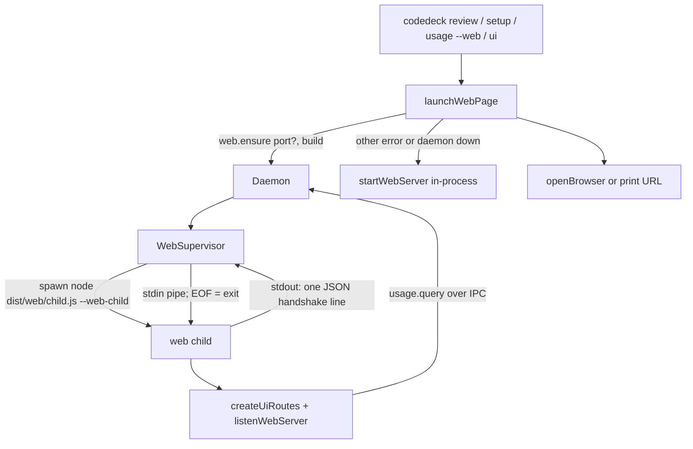

# Web daemon design

**Spec**: `.specs/features/web-daemon/spec.md`
**Status**: Draft (revised after review: HTTP moved from the daemon process into a supervised child)

---

## Architecture Overview

The daemon supervises one web child process. The child is today's in-process server (`createUiRoutes` + the shared listener) started from `dist/web/child.js`. Web commands stop hosting HTTP: they ensure the daemon, call `web.ensure` with their build identity, and open or print the URL. When the build differs, the daemon replaces only the child. Sessions and the daemon process are never involved. The in-process server survives as the fallback.

---

## Code Reuse Analysis

### Existing Components to Leverage

| Component | Location | How to Use |
| --- | --- | --- |
| Route table | `src/cli/commands/ui.ts:21-48` (`createUiRoutes`) | The web child and the in-process fallback serve it with default dependencies. |
| Listener, security, dispatch | `src/web/server.ts:79-196` | Split `startWebServer` into `listenWebServer` (listen + security + close, no signals, no browser) and the existing wrapper. |
| Token, Host, cookie, Origin checks | `src/web/security.ts:39-106` | Extend the policy with `api` and page-credential rules. |
| Usage query with fallback | `src/cli/commands/usage.ts:88-128` (`fetchUsageQuery`) | The child's usage route uses it unchanged. |
| Browser opener, port parser | `src/web/server.ts:47-77` | `launchWebPage` and the commands. |
| Daemon spawn | `src/daemon/ipc.ts:197-220` (`ensureDaemonStarted`) | Unchanged; also the model for spawning the child. |
| Daemon entry guard | `src/daemon/daemon.ts` bottom (`--daemon` argv check) | Same pattern for the child (`--web-child`). |
| Shutdown | `src/daemon/daemon.ts:1854` (`runShutdown`) | Sends SIGTERM to the child first, without awaiting. |
| Usage filter resolution | `src/cli/commands/usage.ts:214-243` | The resolved values become URL query parameters. |
| Setup refresh hook | `globalThis.setupPage.refreshCatalog()` (`src/web/setup-page.ts`) | The page calls it itself on `refresh=1`. |

### Integration Points

| System | Integration Method |
| --- | --- |
| IPC protocol | New method `web.ensure { port?, build?, entry? }` → `{ baseUrl, port, token }`. Errors `WEB_LISTEN_FAILED` (details `{ port }`), `WEB_START_FAILED`, `WEB_BAD_ENTRY`. |
| Daemon log | The supervisor's `log(line)` appends to `paths.daemonLog`. |
| Build output | `tsc` emits `src/web/child.ts` to `dist/web/child.js`; no build script change. |

---

## Components

### `checkWebRequest` credential rules (modify)

- **Location**: `src/web/security.ts`
- **Interface**: `checkWebRequest(request, response, security, policy: { htmlPage?: boolean; api?: boolean }): boolean`
- **Behavior**: Host check first (unchanged). POST keeps cookie + Origin. `api` requires a cookie equal to the token for every method, else 403 `forbidden`. `htmlPage` GET: valid single `t` → set cookie + 303 without `t` (unchanged); else valid cookie → pass; else 403 body `open this page with codedeck ui`. `dispatchRequest` passes `api: route?.kind === "api"`.

### Dispatch isolation and `listenWebServer` (modify)

- **Location**: `src/web/server.ts`
- **Interfaces**:
  - `listenWebServer({ routes, port, fallbackToEphemeral?, serverFactory? }): Promise<ListeningWebServer>`
  - `ListeningWebServer = { server; port; baseUrl; security; close(): Promise<void> }`
  - `startWebServer` keeps its signature and behavior and delegates the listen to `listenWebServer`.
- **Behavior**: `dispatchRequest` runs the handler in `try` and attaches `.catch` to a returned thenable. On failure: headers not sent → 500 JSON `{ error }`, else `response.end()`. `listenWebServer` retries once on port 0 when `EADDRINUSE` and `fallbackToEphemeral`. `startWebServer` gains an optional `fallbackToEphemeral` passed through, for the CLI fallback.

### Setup routes return their promises (modify)

- **Location**: `src/web/setup-routes.ts:566-575`
- **Behavior**: Replace `void catalogRoute(...)`, `void refreshRoute(...)`, `void mutationRoute(...)` with `return ...` so the dispatcher sees rejections.

### Review by repo (modify)

- **Location**: `src/cli/commands/review.ts` (handler + in-process command path), `src/web/review-page.ts`
- **Behavior**: `/api/review` requires an absolute `repo` (400 messages per WD-34/35; 404 for `not a git repository`). `ReviewDeps.root` is removed. Until T13, the in-process `review` command opens `/review?repo=<cwd>` so every commit works. The page reads `repo` from `location.search`. Without it, the page shows `Open this page with codedeck review inside a repository.` and fetches nothing. With it, the page appends `&repo=` to every fetch and puts it in the draft key: `codedeck-review:<repo>:<file>:<line>`. The draft scan filters by the current repo prefix.

### `/usage` interval and `/setup` refresh (modify)

- **Location**: `src/web/usage-routes.ts`, `src/web/setup-page.ts`
- **Behavior**: `/usage` passes `search.get("interval") ?? options.page?.interval`. The setup page calls `refreshCatalog()` once after the initial load when `refresh=1`.

### `computeBuildId` (new)

- **Location**: `src/daemon/build-id.ts`
- **Interfaces**: `distRootFor(moduleUrl: string): string` (two directories above the module file). `computeBuildId(root: string): string` (newest `mtimeMs` of `*.js` under `root`, recursive, decimal string, `"0"` if none).

### Web child entry (new)

- **Location**: `src/web/child.ts`
- **Interfaces**:
  - `runWebChild(options: { port?: number; stdin: Readable; stdout: Writable; listen?: typeof listenWebServer; routes?: () => WebRoute[]; build?: string; exit?: (code: number) => void }): Promise<void>`
  - Main guard: `if (process.argv.includes("--web-child"))` parses `--port <n>` and calls `runWebChild` with process streams.
- **Behavior**: Listens with `port ?? 3100` and `fallbackToEphemeral: port === undefined`. On success writes `{"port","token","build"}\n`. On listen failure writes `{"error":{"message","port"}}\n` and exits 1. On stdin `end`/`close` or SIGTERM: `server.close()`, `server.closeAllConnections()`, exit 0 without waiting for the close callback. `process.stdout` gets an `error` listener that ignores `EPIPE`. Build defaults to `computeBuildId(distRootFor(import.meta.url))`.

### `WebSupervisor` (new)

- **Location**: `src/daemon/web-supervisor.ts`
- **Interfaces**:
  - `new WebSupervisor({ spawnChild?: (entry: string, args: string[]) => WebChildProcess; defaultEntry?: string; entryExists?: (path: string) => boolean; log: (line: string) => void; startTimeoutMs?: number; stopTimeoutMs?: number })`
  - `ensure(params: { port?: number; build?: string; entry?: string }): Promise<WebEnsureResult>`
  - `close(): void`
  - `WebChildProcess = { stdin: Writable; stdout: Readable; kill(signal?): boolean; once("exit", cb) }`
  - `WebEnsureError extends Error { code: "WEB_LISTEN_FAILED" | "WEB_START_FAILED" | "WEB_BAD_ENTRY"; details?: { port: number } }`
  - `spawnChild(entry: string, args: string[])`: the entry is the script path
- **Behavior**:
  - `entry` given and (not absolute, not ending in `/web/child.js`, or `!entryExists(entry)`) → `WEB_BAD_ENTRY`, nothing spawned.
  - Child identity is `(entry ?? defaultEntry, build)`. Running and (`build` and `entry` both absent, or both equal to the child's) → stored result. A request that omits `build` but sends the same `entry` also reuses.
  - Running and `build` or `entry` differs → SIGTERM, wait ≤ 3000 ms for `exit`, SIGKILL if still alive, then start from the requested entry.
  - Starting → the shared in-flight promise (a restart shares it too).
  - Start → spawn `entry` with `--web-child` and `--port <n>` when given. Buffer stdout until the first `\n` within 5000 ms, then `stdout.resume()` and discard the rest. Valid line with numeric `port` and string `token` → store `{ baseUrl: "http://127.0.0.1:<port>", port, token, build, entry }`, log `web listening port=<port>`. `error` line → `WEB_LISTEN_FAILED` with details. Invalid JSON, missing fields, exit, or timeout before a line → kill, `WEB_START_FAILED`.
  - A later child `exit` → state none, log `web child exited code=<code>`.
  - `close()` sends SIGTERM and returns.
- **Default spawn**: `spawn(process.execPath, [entry, ...args], { stdio: ["pipe", "pipe", fd] })`, where `fd` is `fs.openSync(path.join(paths.logsDir, "web-child.log"), "a")`, closed in the parent after spawn. `defaultEntry` = `fileURLToPath(new URL("../web/child.js", import.meta.url))`.
- **Constraint**: imports nothing from `src/web/` or `src/cli/` (WD-28).

### Daemon wiring (modify)

- **Location**: `src/daemon/daemon.ts`, `src/daemon/protocol.ts`
- **Behavior**: `web.ensure` lazily builds `this.web = new WebSupervisor({ log })` (constructor option `webSupervisor` for tests), awaits `ensure`, sends `{ result }` or `{ error: { code, message, details } }`. `runShutdown` calls `this.web?.close()` before the drain. Protocol adds `"web.ensure"`, `WebEnsureParams`, `WebEnsureResult`.

### `launchWebPage` (new)

- **Location**: `src/cli/web-launch.ts`
- **Interface**: `launchWebPage(options: { path; query?: Record<string, string>; title; port?: number; open: boolean }, deps?: { client?; openBrowser?; log?; startServer?; build? }): Promise<number>`
- **Behavior**:
  1. `client.ensureDaemonStarted()`. Throws → fallback with the WD-45 message.
  2. `web.ensure { port?, build, entry }`, with build defaulting to `computeBuildId(distRootFor(import.meta.url))` and entry to `fileURLToPath(new URL("../web/child.js", import.meta.url))`. `WEB_LISTEN_FAILED` → print WD-22 and return 1. Any other error → fallback with the WD-44 message.
  3. Explicit `port` ≠ result port → WD-21 notice.
  4. URL = `new URL(path, baseUrl)` + query entries + `t`. Print `<title> on <url>` (after opening, or instead of opening with `open: false`), or the WD-19 line when the opener fails. Return 0.
  - Fallback: `startServer({ routes: createUiRoutes(), port: port ?? DEFAULT_WEB_PORT, fallbackToEphemeral: port === undefined, initialPath, title, open })` where `initialPath` is `path` plus `?` + `new URLSearchParams(query)` only when the query is non-empty. Then return 0 with the process kept alive by the server.
- **IPC error codes**: `IpcClient.request` rejects with `ipcError(res.error)`, an `Error` carrying `code` and `details` (src/daemon/ipc.ts:11). `launchWebPage` reads `error.code` and `error.details.port`.

### Command rewiring (modify)

- `ui`: `launchWebPage({ path: "/", title: "CodeDeck UI" })`.
- `review`: `launchWebPage({ path: "/review", query: { repo: process.cwd() }, title: "CodeDeck review" })`.
- `setup`: TTY check only in the `--tui` branch. Web branch → `launchWebPage({ path: "/setup", query: refresh ? { refresh: "1" } : {} })`. Delete `createSetupCommandRoutes`. Stop defaulting a missing port to 3100.
- `usage --web`: `launchWebPage({ path: "/usage", query })`.
- Commander defaults `String(DEFAULT_WEB_PORT)` on `--port` are removed from ui and review so an omitted port stays undefined.

---

## Error Handling Strategy

| Error Scenario | Handling | User Impact |
| --- | --- | --- |
| Invalid `--port` | Parse before IPC, exit 1 | Port error |
| Explicit port busy | `WEB_LISTEN_FAILED` → exit 1 | `Failed to listen on 127.0.0.1:
: ...` |
| Default port busy | Child uses an ephemeral port | URL on another port |
| Route throws or rejects | 500 JSON | Page error state |
| Child crashes | State reset, next `web.ensure` respawns | Rerun the command |
| Child hangs at start | 5000 ms timeout, kill, `WEB_START_FAILED` → fallback | Terminal stays attached with a notice |
| Old daemon, daemon shutting down, socket error | Fallback | Same |
| Daemon killed with SIGKILL | Child sees stdin EOF and exits | Port freed |
| API call without cookie | 403 | Rerun the command |

---

## Risks & Concerns

| Concern | Location (file:line) | Impact | Mitigation |
| --- | --- | --- | --- |
| Setup routes discard promises | `src/web/setup-routes.ts:566-575` | Unhandled rejection kills the child | T3 returns them; T2 catches them. A crash now costs only the child. |
| `startWebServer` exits on SIGINT/SIGTERM | `src/web/server.ts:135-159` | Would be wrong in a long-lived host | The child uses `listenWebServer` and owns its own SIGTERM path. The daemon never loads the web stack (WD-28). |
| Existing tests hit API routes without a cookie | `tests/usage-web.test.ts`, `tests/setup-web.test.ts`, `tests/web-cli.test.ts`, `tests/review.test.ts`, `tests/review-command.test.ts`, `tests/web-server.test.ts` | WD-29 breaks them | T1 bootstraps the cookie in these tests. |
| Tests pinning the old setup and usage command paths | `tests/setup-wizard.test.ts:1190-1210` (no-TTY error), `tests/setup-cli-contract.test.ts:709-717, 764-798` (refresh injection), `tests/usage-cli.test.ts:300-333` (`startServer` spies) | Break at rewiring | T14 and T15 rewrite them against an injected launcher. |
| Two dist trees on one daemon (this machine: global `codedeck` in nvm `node_modules`, `codedeck-dev` from the checkout) | `web.ensure` identity | Without `entry`, the child would always come from the daemon's tree and restart on every command | `entry` in `web.ensure`; alternating trees restart the child, repeated commands reuse it. |
| Child writes to stdout after the handshake | `src/web/child.ts` | A full pipe would block the child | Supervisor drains stdout; child ignores `EPIPE`. |

---

## Tech Decisions

| Decision | Choice | Rationale |
| --- | --- | --- |
| HTTP host | Supervised child process | Isolates crashes from the daemon, and a restart on build change touches no session. The reviewer's blocker (legacy `daemon.stop` ignoring `ifIdle`) and the "always busy" problem disappear. |
| Child → daemon handshake | One JSON line on stdout | Simplest channel the daemon already has with a spawned child. |
| Orphan prevention | Child exits on stdin EOF | Works on SIGKILL of the daemon, unlike signal forwarding. |
| Usage in child | Existing `fetchUsageQuery` over IPC | No new data path. |
| Review draft key | Prefix with `repo` | One origin now serves many repos. |
