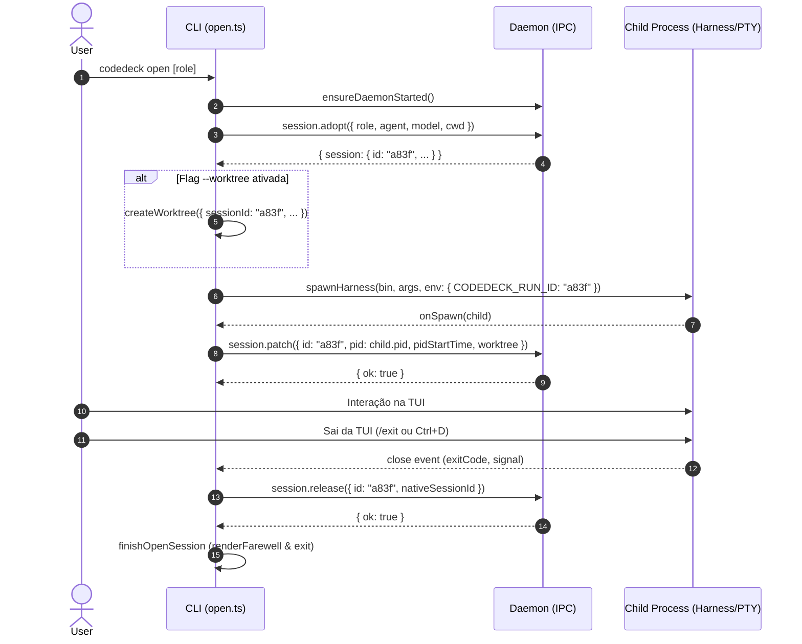

# Open Adopt/Release Lifecycle Specification (Head Session Tracking)

- **Date**: 2026-09-07
- **Status**: Proposed
- **Authors**: Antigravity / CodeDeck Team

---

## 1. Problem Statement

Atualmente, `codedeck open` lança sessões interativas de orquestradores e roles (Claude Code, OpenCode) diretamente pelo processo CLI sem registrar a sessão no banco de dados do daemon CodeDeck (`~/.run-agent/run-agent.db`):

1. **Ausência de identidade gerenciada**: `open` gera um UUID aleatório local via `randomUUID()` e o injeta como `CODEDECK_RUN_ID` no ambiente do harness. O daemon desconhece essa sessão "cabeça" (head session).
2. **Invisibilidade operacional**: `codedeck ps` não exibe a cabeça; apenas os workers despachados via `codedeck run` aparecem na listagem.
3. **Impossibilidade de controle**: `codedeck stop <id>` não consegue interromper a sessão aberta no terminal, pois ela não possui registro no daemon nem PID rastreado.
4. **Desconexão de métricas e worktrees**: `usage.get` agrega apenas os workers e ignora a sessão principal; os caminhos de worktree isolados usavam UUIDs longos em vez dos identificadores canônicos curtos de 4 hex (`a83f`).
5. **Comportamento em crash/reboot**: Se a máquina reiniciar ou o processo morrer, o daemon não possui registro para reconciliar o ciclo de vida da sessão interativa.

---

## 2. Goals

- [ ] **Adoção prévia**: Registrar a sessão da cabeça no daemon via `session.adopt` antes do spawn, gerando um ID canônico curto de 4 caracteres hexadecimais (`generateSessionId()`).
- [ ] **Fim do UUID**: Unificar `session.id`, `runId`, diretório de worktree e `CODEDECK_RUN_ID` no ID curto de 4 hex.
- [ ] **Associação de processo**: Registrar `pid` e `pidStartTime` logo após o spawn via `session.patch`, viabilizando parada segura (`killTree`) e validação contra reciclagem de PID.
- [ ] **Ciclo de vida limpo (Ciclo A)**:
  - Ao fechar normalmente ou pelo usuário (TUI close / exit), `session.release` marca a sessão ativa como `completed`.
  - Se a cabeça já estiver em estado terminal (`stopped`, `failed`, `completed`), `session.release` é um no-op idempotente.
  - No `recover()` do daemon: se `origin = "open"` e o PID está morto, marca `completed` (não `orphaned`). Se o PID está vivo e com identidade íntegra, preserva `working` sem tentar `driver.attach`.
- [ ] **Isolamento de parada**: `codedeck stop <id>` na cabeça mata o processo do harness via `killTree`, marcando `stopped`. **Não mata nem interrompe os workers** que compartilham o mesmo `runId`.
- [ ] **Discriminação durável**: Adicionar coluna `origin TEXT` no SQLite (`"open"` para sessões adotadas, `null` ou `"run"` para workers/tarefas normais).
- [ ] **Proteção de comandos**: `session.send` na cabeça rejeita com `CAPABILITY_NOT_SUPPORTED`. `session.logs` retorna lista vazia de eventos.
- [ ] **Agregação de uso**: `usage.get` inclui a cabeça na soma por `runId` (com custo/tokens zero até haver reporte).

---

## 3. Out of Scope

| Item | Motivo |
| ---- | ------ |
| Envio de mensagens via daemon (`session.send`) para sessões `open` | A cabeça é interativa e controlada pelo terminal/PTY do usuário, não por turnos headless de driver. |
| Matar workers automaticamente no `stop` da cabeça | Decisão explícita de arquitetura: workers continuam independentes em background completando suas tarefas. |
| Ingestão e streaming contínuo de logs da TUI via daemon | A TUI pinta diretamente no terminal/PTY; `session.logs` retorna eventos vazios para `origin = "open"`. |
| Nova coluna dedicada na tabela textual do `codedeck ps` | Nesta fatia, a cabeça aparece como uma linha normal de sessão com `name = role`. |
| Suporte a PTY/interatividade remota via daemon | `open` segue sendo lançado pelo CLI conectado localmente ao stdout/stdin do usuário. |

---

## 4. Design Decisions & Assumptions

| Decisão | Escolha | Justificativa |
| ------- | ------- | ------------- |
| Ciclo de encerramento | **Ciclo A** (morte / saída interativa → `completed`) | Em sessões interativas, a saída do usuário ou o fim do processo do harness representa conclusão natural da sessão interativa, e não falha/orfandade. |
| Três métodos de RPC | `session.adopt`, `session.patch`, `session.release` | O ID curto precisa existir antes do spawn (`CODEDECK_RUN_ID` + worktree); o PID só existe após o spawn; o encerramento ocorre no fechamento do processo. |
| Efeito do `stop` na cabeça | Apenas a cabeça morre (`killTree(pid, 3000, pidStartTime)`) | Workers em background devem ter a chance de concluir seus commits/análises independentemente. |
| Idempotência do `release` | Se status já for terminal (`stopped`, etc.), retorna 200 OK no-op | Garante que `codedeck stop <id>` prévio não seja sobrescrito para `completed` quando a janela da TUI fechar. |
| `origin TEXT` no SQLite | Coluna explícita com migração segura | Não inferir origem pela ausência de arquivos `.ndjson`; estado durável e explícito para `recover` e `stop`. |
| PID patcheado | `child.pid` (processo do harness/script), nunca `process.pid` do CLI | Permite que o daemon sinalize o harness; o CLI intercepta o encerramento do filho, restaura o terminal, grava release e imprime o farewell. |
| Tratamento de falhas pré-spawn | `try/catch` no CLI limpando sessão adotada para `failed` | Impede que erros de git worktree ou preflight deixem sessões zumbis `working` para sempre. |
| Captura de `nativeSessionId` | Enviado no payload de `session.release` | `takeSessionId(sessionFile)` lê o UUID/ID nativo ao sair; persistir na linha enriquece `codedeck show` e futuros resumes. |
| Autodetecção de `pidStartTime` | Daemon resolve `processStartTime(pid)` caso omitido | Evita falhas de `STOP_UNSAFE` e garante verificação de identidade em Linux mesmo se o cliente passar apenas o PID. |

---

## 5. Protocol & API Specification

### 5.1 `session.adopt`

Chamado pelo CLI `open` **antes** do spawn do harness. Cria a linha no SQLite sem inicializar driver ou tailer.

- **Método IPC**: `"session.adopt"`
- **Requisição**:
  ```typescript
  export interface AdoptSessionRequest {
    method: "session.adopt";
    params: {
      role: Role; // ex: "orchestrator", "architect", "reviewer"
      agent: AgentId; // ex: "claude", "opencode"
      model?: string;
      cwd: string;
      worktree?: string;
      branch?: string;
      baseCommit?: string;
    };
  }
  ```
- **Comportamento do Daemon**:
  1. Gera ID com `generateSessionId()` (4 hex). Garante ausência de colisão.
  2. Define `runId = id`, `origin = "open"`, `status = "working"`, `name = params.role`.
  3. Grava no banco com `createdAt = now()`, `updatedAt = now()`.
  4. **Não** chama `driver.startSession`, **não** aloca tailers, **não** inicia runtime.
  5. Retorna `{ session }`.
- **Resposta**:
  ```typescript
  { result: { session: Session } }
  ```

### 5.2 `session.patch`

Chamado pelo CLI `open` **imediatamente após** o spawn do harness.

- **Método IPC**: `"session.patch"`
- **Requisição**:
  ```typescript
  export interface PatchSessionRequest {
    method: "session.patch";
    params: {
      id: string;
      pid?: number;
      pidStartTime?: string;
      worktree?: string;
      branch?: string;
      baseCommit?: string;
      cwd?: string;
    };
  }
  ```
- **Comportamento do Daemon**:
  1. Localiza a sessão pelo `id`. Se inexistente, retorna `SESSION_NOT_FOUND`.
  2. Se `pid` foi fornecido e `pidStartTime` estiver ausente, resolve via `processStartTime(pid)` no host Linux.
  3. Atualiza os campos fornecidos via `this.sessions.update(...)`.
  4. Retorna `{ ok: true, session: Session }`.

### 5.3 `session.release`

Chamado no encerramento da sessão em `finishOpenSession` / `onClose`.

- **Método IPC**: `"session.release"`
- **Requisição**:
  ```typescript
  export interface ReleaseSessionRequest {
    method: "session.release";
    params: {
      id: string;
      nativeSessionId?: string;
      status?: "completed" | "failed";
      error?: string;
    };
  }
  ```
- **Comportamento do Daemon**:
  1. Localiza a sessão pelo `id`. Se inexistente, retorna `SESSION_NOT_FOUND`.
  2. Se `isTerminalStatus(session.status)` for verdadeiro (`stopped`, `completed`, `failed`, `interrupted`):
     - **No-op**. Retorna `{ ok: true }` sem alterar o status (preserva `stopped` de um `codedeck stop` prévio).
  3. Se a sessão estiver ativa (`working`):
     - Se `params.status === "failed"`:
       - Atualiza status para `"failed"` via `setStatus(id, "failed", { lastEvent: params.error || "pre-spawn failed" })`.
       - Emite evento `session.failed` com o erro informado.
     - Caso contrário (padrão `"completed"`):
       - Atualiza status para `"completed"` via `setStatus(id, "completed", { lastEvent: "completed", ... })`.
       - Se `nativeSessionId` foi fornecido, persiste no banco.
       - Emite e faz broadcast do evento terminal `session.completed` (`reason: "completed"`).
  4. Retorna `{ ok: true }`.

### 5.4 Comportamento de Métodos Existentes para `origin = "open"`

- **`session.stop`**:
  - Verifica locks e status terminal.
  - Como não há runtime/handle na registry para a sessão cabeça, o driver cai no fallback:
    ```typescript
    if (!session.pid) return;
    if (!session.pidStartTime) throw new Error(`Cannot safely stop session ${session.id}: PID identity is unavailable`);
    await killTree(session.pid, 3000, session.pidStartTime);
    ```
  - Define status para `"stopped"`.
  - Envia sinal ao processo do harness (`child.pid`).
  - **Não** sinaliza outras sessões com o mesmo `runId`.
- **`session.send`**:
  - Antes de qualquer processamento:
    ```typescript
    if (s.origin === "open") {
      send({ error: { code: "CAPABILITY_NOT_SUPPORTED", message: "Interactive open sessions do not support send" } });
      return;
    }
    ```
- **`session.logs`**:
  - Consulta tabela `events`. Como a cabeça não gera eventos intermediários, retorna `{ session: s, events: [] }` (ou apenas o evento final após release).
- **`session.diff`**:
  - Funciona normalmente a partir de `s.cwd`, `s.worktree` e `s.baseCommit`.

---

## 6. Persistence & Schema Changes

### 6.1 Migração SQLite (`src/store/database.ts`)

Adição da coluna `origin`:
```sql
ALTER TABLE sessions ADD COLUMN origin TEXT;
```
Em `src/store/database.ts`:
```typescript
const additions: Array<[string, string]> = [
  // ...
  ["origin", "TEXT"],
];
```

### 6.2 Mapeamento de Entidade (`src/core/session.ts` & `src/store/sessions.ts`)

- Campo opcional em `Session`:
  ```typescript
  export interface Session {
    // ...
    origin?: "open" | "run" | string | null;
  }
  ```
- Inclusão em inserts (`create`), updates (`update`) e conversão de linha (`rowToSession`).

---

## 7. Recover & Shutdown Lifecycle

### 7.1 Reconciliação no Boot do Daemon (`recover()`)

Ao iniciar, o daemon itera sobre sessões ativas (`listActive()`):

1. **`s.status === "interrupted"`**: Continua inalterado (mantém integridade de desligamento).
2. **Reuso de PID**: Se `pidReused` for detectado, marca `failed` com `failure.reason = "pid_reused"`.
3. **`s.origin === "open"`**:
   - **PID vivo e identidade verificada (`processAlive(pid) && currentStart === recordedStart`)**:
     - Permanece em `working`.
     - **Não** tenta executar `driver.attach()`.
     - Não adiciona a runtime handles.
   - **PID morto (`!processAlive(pid)`)**:
     - Transiciona para `completed` (Ciclo A), com `lastEvent = "process exited"`.
     - **Não** transiciona para `orphaned` ou `failed`.
   - **PID ausente (`pid == null`)**:
     - Se nunca houve patch de PID (ex: máquina desligou no microssegundo pós-adopt), marca como `failed`.

### 7.2 Desligamento do Daemon (`handleShutdown`)

- Desligamento de máquina / SIGTERM segue o fluxo padrão de power-graceful:
  - Sessões ativas com PID recebem `markInterrupted(s, "shutdown")` e `killTree(s.pid, 1500, s.pidStartTime)`.
  - Sessões `origin = "open"` ativas tornam-se `interrupted`, como qualquer outra sessão.

---

## 8. CLI `open` Execution Flow

O comando `codedeck open [role]` passa pelo seguinte fluxo sequencial:



### Tratamento de Falhas
- Se `createWorktree` ou a inicialização pré-spawn falhar, o bloco `catch` executa `session.release({ id })` ou define status `failed`, garantindo que o banco de dados não mantenha sessões `working` sem processo correspondente.
- A chamada a `session.release` é envolvida em `try/catch` à prova de falhas: mesmo se a conexão IPC cair, o terminal é restaurado e o banner de farewell é impresso.

### Suporte a `--print` / `-p`
- Execuções não-interativas (`isNonInteractiveLaunch`) compartilham exatamente o mesmo ciclo de vida: adotam antes do spawn, gravam o PID após o spawn e executam release na saída rápida do harness.

---

## 9. Verification & Acceptance Criteria

### 9.1 Testes Automatizados

1. **Adopt sem Driver**:
   - `session.adopt` cria sessão no SQLite com `origin = "open"`, `status = "working"` e `runId = session.id`.
   - Nenhuma chamada a `driver.startSession` ou tailer é disparada.
2. **Correlação de Workers**:
   - Worker disparado com `CODEDECK_RUN_ID = head.id` tem `run_id = head.id` no banco.
   - `usage.get(head.id)` agrupa a cabeça e seus workers.
3. **Release Idempotente & Ciclo A**:
   - `session.release` em sessão ativa transiciona para `completed`.
   - `session.release` em sessão `stopped` mantém status `stopped` (no-op 200).
   - Workers ativos com mesmo `runId` continuam em `working` após o release da cabeça.
4. **Isolamento do Stop**:
   - `session.stop(head.id)` encerra o PID da cabeça e marca `stopped`.
   - Workers ativos continuam vivos e com status intacto.
5. **Reconciliação no Boot (`recover`)**:
   - Sessão `origin = "open"` com PID vivo e `pidStartTime` coincidente permanece `working` sem reatachar driver.
   - Sessão `origin = "open"` com PID morto transiciona para `completed` (não `orphaned`).
   - Sessão com PID reciclado transiciona para `failed` (`pid_reused`).
6. **Contrato de Comandos**:
   - `session.send` em sessão `origin = "open"` retorna erro `CAPABILITY_NOT_SUPPORTED`.
   - `session.logs` retorna lista de eventos vazia.
7. **CLI `open` Mockado**:
   - Validação de que `adopt` é chamado estritamente antes de `spawnHarness`.
   - `onSpawn` dispara `session.patch` com `child.pid`.
